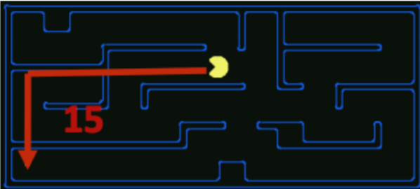
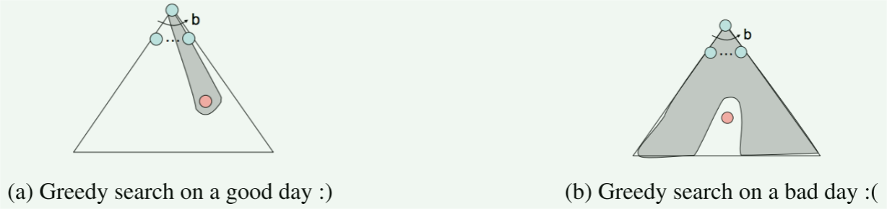
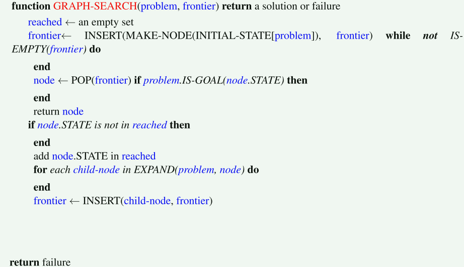
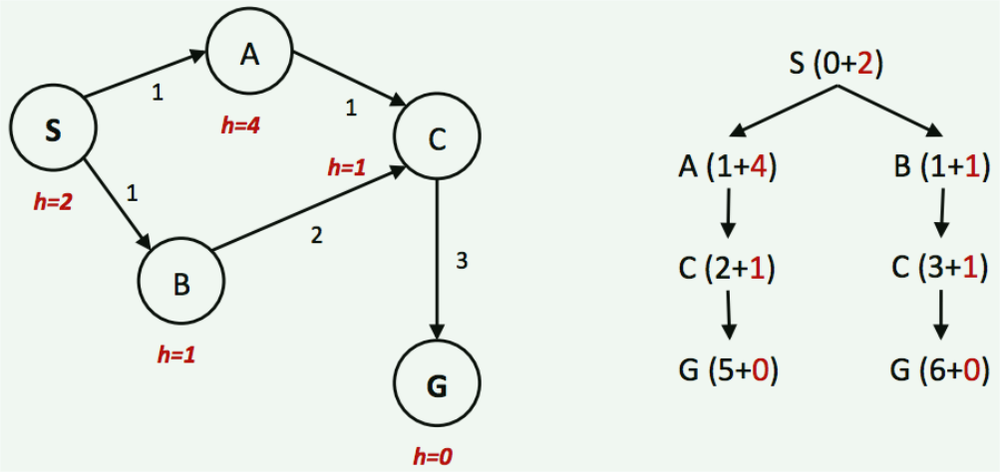
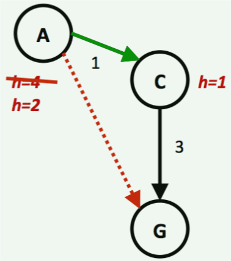

# 有信息搜索（Informed Search）

UCS是一种好的搜索算法，因为它不仅完备而且最优。但是，它可能相当慢，因为在搜索目标的过程中，它从起始状态向各个方向扩张。

> 因为没有目标状态的其余附加信息，所以需要使用遍历的方式来查找是否存在目标状态，因此较慢。

如果我们对搜索时需要重点关注的方向有一些概念（目标所处的方位），就可以显著提高性能，并且更快 “逼近” 目标。这正是有信息搜索的重点。

## 启发式（Heuristics）

启发式是允许评估到目标状态的距离的驱动力 —— 它们是以状态作为输入，并输出相应适应值的函数。由这样一个函数执行的计算是特定于要解决的搜索问题的。

> 适应值一般用来评价解的质量（好坏）
>
> 常用的距离度量方式有：Euclidean distance、Mahalanobis distance、Manhattan distance and Hamming distance etc. 这些距离度量方式都可以作为启发式函数。

由于一些原因（将在下面的 $ A^* $ 搜索算法中讨论），我们通常希望**启发式函数是到目标的剩余距离的一个下界**。因此，启发式通常可作为松弛问题的解法 - solutions to relaxed problems（其中原始问题的一些约束已被删除）。

> 在最短路径问题中，我们已经接触过 “松弛” 这个概念，松弛指的是在当前已知信息的基础上，尽可能地放宽约束，以期望获得更好的解决方案。
>
> 当然，这个最好是有标准的，衡量一个好的解决方案的方式就是启发式函数。

回到Pacman例子，考虑之前描述的路径问题。用于解决该问题的一个常见启发式是Manhattan距离，对于 $ (x_1, y_1),\space (x_2, y_2) $ 两点，其定义如下：

$$ Manhattan(x_1, y_1, x_2, y_2) = |x_1 - x_2| + |y_1 - y_2| $$

上图可视化的显示了Manhattan距离帮助解决的松弛问题 —— 假设Pacman想去迷宫的左下角，其计算了在迷宫中没有墙壁的情况下Pacman当前位置到预期位置的距离。该距离正是松弛搜索问题中的精确(exact)目标距离，与之对应的是实际搜索问题中的估计(estimated)目标距离。

有了启发式，在智能体中非常容易实现这样的逻辑：使智能体在决定执行哪个动作时，能 “倾向于” 扩张评估结果离目标状态更近（一般而言，对应于适应值更小）的状态。

这种偏好（preference）的理论非常强大，并被以下两种实现启发式函数的搜索算法所利用：贪心搜索和 $ A^* $。

## 贪心搜索（Greedy Search）

### Description

贪心搜索是一种总选择具有**最小启发式值**（the lowest heuristic value）的边界节点，对应于它认为离目标最近的状态，用于扩展的探索策略。

> 选择 "最小" 的这一操作体现了 "贪心" 的策略，但也正如下面讨论的，这样一种贪心是否是好的，是需要证明的，也就是说证明*贪心正确性*。

### Frontier Representation

贪心搜索与UCS的操作一致，均使用优先队列表示边界。不同之处在于，贪心搜索使用启发式值形式的估计前向代价，而不是使用计算后向代价（到达状态的路径上的边权值之和）

> 前向代价指的是从起始状态到目标状态的代价，后向代价指的是从目标状态到起始状态的代价
>
> *computed backward cost & estimated forward cost*
>
> 估计代价其实是实际代价的一个下界，这里的计算后向代价可以理解为实际上的精确的从目标状态到起始状态的代价。

### Completeness & Optimality

如果存在目标状态，贪心搜索不保证能找到它。同时，贪心搜索也不是最优的，特别是在选择了性能非常差的启发式函数的情况下。

通常在不同的场景中，贪心搜索的表现相当难预测，它可能直接到达目标状态，也可能像一个没有得到良好引导的DFS那样探索所有错误区域。—— 这很大程度上取决于启发式函数。

## $ A^* $ 搜索

### Description

$ A^* $ 搜索是一种总选择具有最小估计总代价的边界节点用于扩张的探索策略，其中总代价指的是从起始节点到目标节点的全部代价

> 由于当前节点到目标节点的实际代价并不知道（因为此时并没有实际计算），所以是估计当前节点到目标节点的前向代价，同时由于从当前节点到起始节点的后向代价已经被计算出，所以总代价是实际计算后向代价与估计前向代价的总和。

### Frontier Description

与贪心搜索和UCS类似，$ A^* $ 搜索也使用优先队列来表示边界。同样地，唯一的区别在于优先级选取的策略不同。

$ A^* $ 通过将UCS中使用的总后向代价（到达状态的路径中的边权之和），和贪心搜索中使用的估计前向代价（启发式值）相加，有效地生成了从起始状态到目标状态的估计总代价。

考虑到我们想要最小化从起始到目标的总代价，这是一个很好的选择。

### Completeness and Optimality

给定一个合适的启发式（我们马上就会讨论到），$ A^* $ 搜索既是完备的，又是最优的。它是到目前为止我们讨论过的所有其他搜索策略的优点的结合体，其将贪婪搜索的快速性与UCS的最优性和完备性结合在一起。

> 可以看到，有信息搜索其实非常依赖于我们对于信息的利用方式。如果我们采用一种好的方式来利用信息，我们能更快速的找到目标；反之，我们甚至可能永远找不到目标。

## Admissibility and Consistency

> 可容许性（可行性）和一致性
>
> ---
>
> **为什么要研究一种启发式是否是可容许的或者一致的**？
>
> 对于某个搜索算法而言，我们最朴素的要求是这种算法搜索出来的结果应该是到达目标路径的最优解。而在树搜索算法中，保证这种最优性所需的条件就是可容许性。也就是说，一个启发式是可以被我们所接受的，则其应该满足可容许性约束。
>
> 进一步，一般情况下，树搜索算法可能不能满足我们的要求，因为很多情况下我们需要在同一路径上多次到达同一状态（考虑一个简单情况，有一条直线道路，在道路两端有两个装置需要我们开启，如果出发点在路中间，那么我们势必会多次经过道路的某一段）
>
> 故我们需要将树搜索算法扩展到图搜索算法上，那么我们就要问了，这样的一种扩展能保证我们得到的结果仍是最优的吗？不一定！在后面我们会给出一种不满足最优性的示例。因此，我们需要一个比可容许性更强的约束，来使得启发式在图搜索算法下，也可以帮助搜索算法找到最优解。而这种更强的约束，就是一致性约束。这里的一致，指的是使用该启发式的搜索算法无论是在树搜索场景下，还是在图搜索算法下，都能找到最优解的一致性。

到目前为止，我们讨论了启发式的定义以及它们如何应用在贪心和 $ A^* $ 中。现在，让我们花点时间讨论一下*什么是好的启发式*

> 评价一个启发式的好坏的指标在于是否满足可容许性 or 一致性。

为了做到这一点，让我们先用下面的定义重述一下在UCS、贪心和 $ A^* $ 中使用的确定优先队列的优先级的方法：

- $ \text{g}(n) $：该函数表示UCS中计算的**总后向代价**。
- $ h(n) $：贪心搜索中使用的**启发式值**函数，或**估计前向代价**。
- $ f(n) $：该函数表示 $ A^* $ 搜索中使用的**估计总代价**。$ f(n) = \text{g}(n) + h(n) $。

> 假设有两节点 $ A, B $，规定 $ A \rightarrow B $ 为前向，则 $ B \rightarrow A $ 为后向。
>
> 在这里，前向和后向的参考节点均为当前节点，在从起始节点到目标节点的路径上，定义前向和后向。

在讨论什么是 “好的” 启发式之前，必须先回答 **$ A^* $ 保持完备性和最优性的性质是否与我们使用的启发式函数无关**的问题。

事实上，很容易找到破坏这两个好的性质的启发式。例如，考虑启发函数 $ h(n) = 1 - \text{g}(n) $。无论什么搜索问题，使用该启发式都会生成以下结果：

$$
\begin{align}
f(n) &= \text{g}(n) + h(n) \\
     &= \text{g}(n) + (1 - \text{g}(n)) \\
     &= 1 \\
\end{align}
$$

因此，这样一个启发式使 $ A^* $ 搜索退化为所有边的代价均相等的BFS搜索情况。正如我们已经讨论过的那样，BFS在一般情况下（边权不是常数）并不保证最优性。

使用 $ A^* $ 树搜索算法时，保证最优性所需的条件称为**可容许性**。可容许性约束表明，用**可容许的启发式估计的值既不是负的，也不是过估计的**（因此，一个可容许的启发式函数是乐观的，这也解释了前面所说的“下界”）。

定义 $ h^*(n) $ 为从给定节点 $ n $ 到达目标状态的真实最优前向代价，我们可以用数学方法将可容许性约束表述如下：

$$ \forall n,\space 0 \le h(n) \le h^*(n) $$

**定理**：对给定的搜索问题，如果一个启发式函数 $ h $ 满足可容许性约束，则对该搜索问题使用带 $ h $ 的 $ A^* $ 树搜索算法将产生最优解。

*证明*：假设给定搜索问题的搜索树中有两个可达目标状态，一个是最优目标 $ A $，一个是次优目标 $ B $。因为 $ A $ 是可以从起始状态到达的，所以 $ A $ 的某个祖先 $ n $（可能包括 $ A $ 自身）当下一定在边界上。通过以下三个引理，我们断言 $ n $ 将比 $ B $ 更早被选中用于扩张：

1. $ \text{g}(A) < \text{g}(B). $ 因为 $ A $ 是最优的，而 $ B $ 是次优的，我们可以得出结论 $ A $ 相对 $ B $ 而言有更小的到起始状态的后向代价。
2. $ h(A) = h(B) = 0. $ 因为已知启发式满足可容许性约束（定理假设的条件中给出了），加之 $ A, B $ 均为目标状态，故从 $ A $ 或 $ B $ 到目标状态的真正最优成本就是 $ h^*(n) = 0 $；因此 $ 0 \le h(n) \le 0 $。
3. $ f(n) \le f(A). $ 由于 $ h $ 满足可容许性，故 $ f(n) = \text{g}(n) + h(n) \le \text{g}(n) + h^*(n) = \text{g}(A) = f(A) $。这意味着，经由节点 $ n $ 的路径的总代价不超过 $ A $ 的真实反向代价，也就是 $ A $ 的总代价。

结合陈述1, 2 可知 $ f(A) < f(B) $：

$$ f(A) = \text{g}(A) + h(A) = \text{g}(A) < \text{g}(B) = \text{g}(B) + h(B) = f(B) $$

结合上述导出不等式与陈述3，可得到一个简单结果：

$$ f(n) \le f(A) \land f(A) < f(B) \Rightarrow f(n) < f(B) $$

因此可以得出结论，$ n $ 比 $ B $ 先扩张。因为我们已对任意 $ n $ 证明了这一点，故可得出结论：$ A $ 的所有祖先（包括 $ A $ 本身）都在 $ B $ 之前扩张。

在上面的树搜索中，我们发现了一个问题：在某些情况下，可能会困在状态空间图中无限地搜索同一个循环，永远找不到一个解。

即使在搜索技术不涉及到这种无限循环的情况下，由于有多种方法到达同一个节点，我们也经常会多次访问同一个节点。这将导致更多的工作，一个自然的解决方法是简单地跟踪已经扩张的节点，并且永远不要再扩张它们。

更明确地说，在使用你选择的搜索方法时，**维护一个 “已访问” 的扩张节点集**。然后，确保每个节点在扩张前并没有在这个集合中，并且如果没在集合的话，则在扩张后将其加入集合。

这种优化后的树搜索称为**图搜索**（graph search），其伪代码如下：

> **注意**：在其他课程中，你可能已经在图论背景下接触过 “树” 和 “图” 的概念。具体上，树是一种满足某些约束（连通和无环）的图。这不是我们在这门课中所做的树搜索和图搜索的区别！！！

注意：在具体实现中，将已访问节点集存为一个不相交集合而不是一个列表是非常重要的。将其存储为列表需要花费 $ O(n) $ 次操作来检查成员关系（是否存在与该集合中），这抵消了图搜索能提供的性能提升。

> 在python中，可以使用内置数据结构`set`，该数据结构用hash表的方式实现了常数时间内的判断。

**警告**：图搜索往往会破坏 $ A^* $ 的最优性，即使是在可容许的启发式下也是如此。

考虑以下简单的状态空间图和相应的搜索树，其上标注了权重和启发式值：

上例中，明显最优路径是 $ S → A → C → G $，其总路径成本为 $ 1 + 1 + 3 = 5 $。到达目标的唯一其他路径 $ S → B → C → G $ 的路径成本为 $ 1 + 2 + 3 = 6 $。

然而，由于 $ A $ 的启发式值比 $ B $ 的启发式值大得多，因此 $ C $ 将首先作为 $ B $ 的子节点沿着第二条次优路径扩张，然后将其放入 “已访问” 集合中。导致 $ A^* $ 图搜索算法在将其作为 $ A $ 的子节点访问时无法重新扩张，故永远找不到最优解。

综上，为在 $ A^* $ 图搜索算法中保持最优性，我们需要一个**比可容许性更强的性质**。

**一致性**：一致性的核心思想是，我们要求*启发式的估计值不仅小于从任意给定结点到目标结点的总距离，而且小于图中每条边的代价 / 权值之和*。

*由启发式函数度量的边的代价就是两个关联节点的启发式值之差*。数学上，一致性约束可表示为：

$$\begin{array}{ll} \forall A,C & h(A) - h(C) \le cost(A, C) \end{array} $$

**定理**：对于一个给定的搜索问题，如果一个启发式函数 $ h $ 满足一致性约束，在该搜索问题上使用带 $ h $ 的 $ A^* $ 图搜索算法将生成一个最优解。

*Proof*：为证明上述定理，我们先证明当使用一致性启发式进行 $ A^* $ 图搜索时，每当移除一个节点用于扩张时，我们都已经找到了到达该节点的最优路径。

利用一致性约束，我们可以证明沿任意路径到节点 $ n $ 的 $ f(n) $ 值是单调非减的。定义两节点 $ n \space \& \space n' $，其中 $ n' $ 是 $ n $ 的子节点，证明如下：

$$
\begin{align}
    f(n') &= g(n') + h(n') \tag{1} \\
          &= g(n) + cost(n, n') + h(n') \tag{2} \\
          &\ge g(n) + h(n) \tag{3} \\
          &= f(n) \tag{4} \\
\end{align}
$$

若对于路径上的每个父 - 子节点对 $ (n, n') $, $ f(n') \ge f(n) $，则沿着该路径上的 $ f(n) $ 值一定是单调非降的。我们可以检查上述图中 $ f(A), f(C) $ 之间违反了该规则。

有了这个结论之后，我们现在可以证明，每当移除一个节点 $ n $ 用于扩张时，都已经找到了到达该节点的最优路径。

反证法，假设当 $ n $ 从边界删除时，找到的到达 $ n $ 的路径是次优的。这意味着边界中一定存在某个 $ n $ 的祖先 $ n'' $，其从未被扩张过，但是在到达 $ n $ 的最优路径上。

这是矛盾的，我们已经证明了沿同一条路径的 $ f $ 值是单调非降的，因此 $ n'' $ 应该在 $ n $ 之前被删除用于扩张。—— 原因在于，对于 $ A^* $ 而言，我们维护的是一个以 $ f $ 值为优先级的优先队列，并且每次删除用于扩张的节点都是 $ f $ 值最小的节点。

为完成证明，只需再证：最优目标 $ A $ 在任意次优目标 $ B $ 之前被删除用于扩张并返回。这是平凡的，因为 $ h(A) = h(B) = 0 $，故：

$$ f(A) = g(A) < g(B) = f(B) $$

正如我们在可容许性约束中证明的 $ A^* $ 树搜索算法的最优性一样。因此，我们可以得出结论：在使用满足一致性的启发式的情况下，$ A^* $ 图搜索算法是最优的。

在我们继续之前，上面的讨论中有几个重要的点需要注意：

- 对于一个可容许的 / 一致的启发式我们说他是有效的，根据定义，其必须满足对任意目标状态 $ G,\space h(G) = 0 $
- 此外，一致性不仅仅是一个比可容许性更强的约束，一致性还可以推出可容许性。
  - 这仅仅源于这样一个事实：如果没有过估计边的代价（正如一致性所保证的那样），从任何节点到目标节点的总估计成本也不会是过估计的。

考虑下面三个节点的网络作为一个可容许但不一致的启发式示例：

红色虚线对应的是总目标估计距离。当 $ h(A) = 4 $ 时，启发式是可容许的，因为 $ A $ 到目标的距离为 $ 4 \ge h(A) $，同样 $ h(C) = 1 \le 3 $ 。

然而，从 $ A $ 到 $ C $ 的启发式代价是 $ h(A) − h(C) = 4 − 1 = 3 $。启发式估计到的 $ A, C $ 之间的边的代价为 $ 3 $，而真实值是 $ cost(A, C) = 1 $，一个更小的值。

由于 $ h(A)−h(C) \nleq cost(A, C) $，因此这个启发式是不一致的。然而，对 $ h(A) = 2 $ 进行相同的计算，可以得到 $ h(A) − h(C) = 2 − 1 = 1 \le cost(A, C) $。因此，使用 $ h(A) = 2 $ 使我们的启发式一致。

## 优势（Dominance）

既然我们已经定义了可容许性和一致性，以及它们在保持 $ A^* $ 搜索的最优性中的作用。我们可以回到最初的问题，即：构造 “好的” 启发式，以及如何判断一个启发式是否比另一个好。

对此的标准度量是优势（dominance）。如果启发式 $ a $ 优于启发式 $ b $，则对于状态空间图中的每个节点而言，$ a $ 的目标估计距离比 $ b $ 的目标估计距离大。数学上：

$$ \forall n \text{ : } h_a(n) \ge h_b(n) $$

> 更加接近于真实距离？？？

Dominance描述了一个启发式优于另一启发式的一个非常直观的想法：如果一个可容许的/一致的启发式是dominant的，那么它一定更好，因为它总是更接近真实值的估计从任何给定状态到目标的距离。

此外，平凡启发式的定义为 $ h(n) = 0 $，$ A^* $ 使用该启发式时将退化为UCS。所有可容许的启发式均优于平凡启发式。

平凡启发式通常被视为搜索问题的半格的基础，它位于半格的底部，构成了优势层次结构（a dominance hierarchy）的一部分。—— 将dominance视为一种关系，两个启发式可以比较，意味着一个启发式是优于另一个启发式的，通常称为dominant

> 在人工智能领域，**半格（semi-lattice）是一个抽象的数学结构**，用于描述元素之间的**偏序关系**。在这个结构中，元素之间存在部分排序，但不一定是全序（total order）。
>
> 具体来说，半格包含了一组元素，其中的每个元素都与其他元素存在一种偏序关系，即有些元素可能在关系上是相对较小的，而有些元素可能在关系上是相对较大的，但不一定能够完全比较出它们的大小关系。
>
> 在搜索问题中，半格通常用来表示解空间中解的偏序关系。例如，在解空间中，一个解可能比另一个解更优，但它们之间不一定是完全可比较的，因为有些解可能在某些方面优于另一个解，而在其他方面则不如后者。因此，半格可以用来描述解空间中解的偏序关系，从而帮助搜索算法更有效地探索解空间并找到最优解。

下面是一个semi-lattice的例子，其包含了各种启发式 $ h_a, h_b \text{ and } h_c $，从底部的平凡启发式到顶部的精确目标距离：

一般的，应用于多个可容许启发式上的max函数的结果总是可容许的。因为对任意给定状态，启发式输出的所有值都被可容许性条件所约束 $ 0 \le h(n) \le h^*(n) $。该范围内的最大值也一定在相同范围内。相同地，可以在多个一致的启发式上证明类似结果。

*通常的做法是，为任一给定搜索问题生成多个可接受/一致的启发式，并计算它们输出值的最大值，从而生成一个优于所有单独的启发式的启发式。*

## Search: Summary

在这篇note中，我们讨论了搜索问题及其组成部分：状态空间、行为集、转移函数、动作代价、起始状态和目标状态。智能体通过传感器和执行器与环境交互。智能体函数描述了智能体在所有场景下应该执行的动作。智能体的理性是指智能体寻求其期望效用的最大化。最后，我们使用PEAS描述定义了我们的任务环境。

关于搜索问题，他们可以使用多种搜索技术来解决，包括但不限于我们在CS188中学习的五种：

- Breadth-first Search
- Depth-first Search
- Uniform Cost Search
- Greedy Search
- $ A^* $ Search

上面列出的前三个搜索技术是无信息搜索的例子，后面两个则是使用启发式来估计目标距离并优化性能的有信息搜索。

我们还对上述技术的树搜索和图搜索算法进行了区分。
