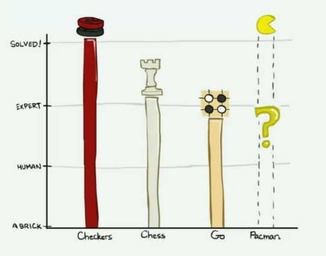
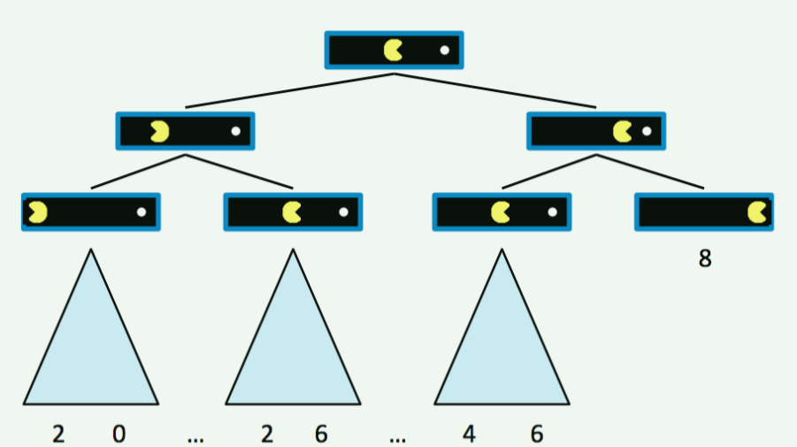
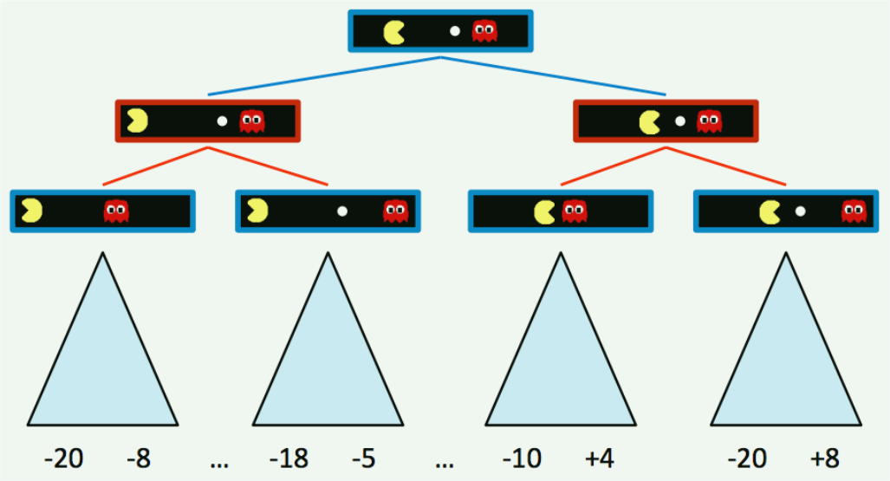
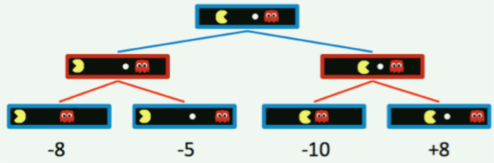
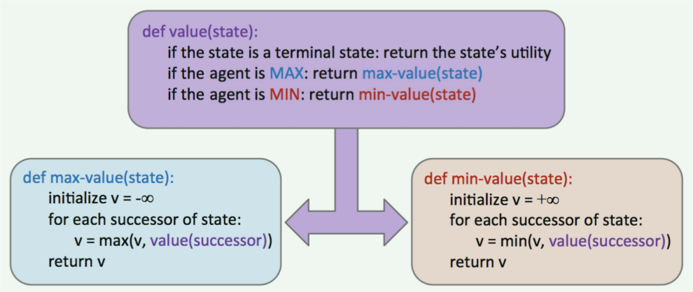

# Game 博弈

在第一篇Note中，我们讨论了搜索问题以及如何高效且最优地解决他们 —— 使用强大的通用搜索算法，我们的智能体可以确定最佳的可能计划，然后简单地执行它以达到目标。

现在，让我们换个角度来考虑这样的场景：智能体有一个或多个试图阻止它们达到目标的**对手**（adversaries）。智能体不能再运行我们已经学过的搜索算法来制定计划，因为我们*通常不能确切地知晓对手会如何计划对付我们以及如何对我们的行动做出反应*。

相反，我们需要运行一种新的算法来生成**对抗搜索问题**（adversarial search problem）的解，这种问题更常被称为**博弈**（games）

博弈的类型有很多，其可以有产生确定性或随机（概率性）结果的行动，可以有任意数量的玩家，也可以是**零和**的（zero-sum）

> 在某些情况下，行动产生随机结果意味着我们不能完全观测到行动产生的效果，这可能是因为对环境的不完全观测。
>
> “零和” 意味着对一方有利的东西将对另一方同等程度有害：不存在 “双赢” 结果（二者之和为0）
>
> 在博弈论中，我们通常用**移动**（move）作为 “动作”（action）的同义词，用**局面**（position）作为 “状态”（state）的同义词。

我们将讨论的第一种博弈类型是**确定性零和博弈**（deterministic zero-sum games），这种博弈的行为具有确定性并且我们的收获直接等价于对手的损失，反之亦然。

考虑这种博弈最简单的方法是将其定义为一个单一的变量值。一个团队或智能体试图最大化它，而另一个团队或智能体试图最小化它，从而有效地将他们置于直接的竞争中。

在吃豆人中，这个变量是分数。你试图通过快速且高效地吃小球来最大化分数，而鬼魂通过先吃掉你来最小化分数。

许多普通的家喻户晓的博弈也属于这一类：

- **跳棋**（Checkers）：第一个跳棋计算机玩家于1950年问世。此后，跳棋成为一个已解游戏（**solved game**），这意味着在任意一方采取最优行动的前提下，任何局面都能够以确定性方式被评估为胜利、失败或平局。

- **国际象棋**（Chess）：1997年，“深蓝” 成为第一个在六场比赛中击败人类国际象棋冠军 Gray Kasparov 的计算机智能体。“深蓝” 由极其复杂的方法构建而成，每秒可以评估超过两亿个局面。目前的项目甚至性能更好，尽管没有那么具有历史意义。

- **围棋**（Go）：围棋的搜索空间比国际象棋大得多，因此大多数人不相信围棋计算机智能体能在未来几年内击败人类世界冠军。然而，由Google开发的AlphaGo在2016年3月历史性地击败了围棋冠军 Lee Sodol

以上所有世界冠军智能体至少在某种程度上都使用了我们将要介绍的**对抗搜索技术**（adversarial search technique）

与返回完整计划的常规搜索不同，对抗搜索返回一个策略或政策（a **strategy** or **policy**），它只是在给定智能体和他们的对手的一些配置的情况下，推荐最好的可能移动。

> 由于竞争的存在，且不知道对手的决策方法，我们无法准确的预测出一条完整的路径。虽然我们可以以一定的概率模拟对手可能进行的移动，但是对于一次确定的博弈，对手在某次移动时的方式是确定的，这种预测对于实际过程没有指导意义。
>
> 相反，只是给出接下来应该做的移动，并在下一次根据这些移动与环境交互的反馈来进行下一步的决策，可以更好的应对敌方的行动。

我们很快就会看到，这种算法具有通过计算产生行为的美丽特性 —— 我们运行的计算在概念上相对简单、可广泛推广，且天然就能在同一团队的智能体之间产生合作并 “超越” 对手。

标准的**博弈形式**包括以下定义：

- **初始状态**：$ s_0 $

- **参与者**：$ Players(s) $ 返回状态 $ s $ 下，轮到其移动的参与者

- **移动**：$ Actions(s) $ 返回状态 $ s $ 下，参与者的所有合法移动

- **转移模型**：$ Result(s, a) $ 返回状态 $ s $ 下，执行动作 $ a $ 所产生的结果结果状态

- **终止测试**（Terminal test）：$ Terminal-test(s) $ 测试状态 $ s $ 是否为终止状态

- **终止值**（Terminal values）：$ Utility(s, player) $ 效用函数，返回博弈结束时终止状态 $ s $ 下参与者 $ player $ 最终的数值收益

## Minimax 极小化极大

我们将考察的第一个零和博弈算法是**极小化极大**（Minimax），该算法在以下激励性假设（motivating assumption）下运行：*我们所面对的对手会表现出最优的行为，并且总执行对我们最不利的移动*。

> 注意该假设 —— “总是表现出最优的行为”，这意味着我们不可能投机，去尝试是否可以得到一个更优的解。在后面引入对手后的情景中，我们将直观的体会到这一点。

为了介绍该算法，我们必须先形式化**终止效用**（terminal utilities）和**状态值**（state value）的概念。一个状态的值是处于该状态的智能体所能获得的最优分数。为直观理解这个概念的意义，观察以下平凡且简单的吃豆人游戏棋盘（board - 将地图网格化，近似认为是一个棋盘）：

假设开始时吃豆人有10分，它每移动一次会损失1分，直到它吃到小球，此时博弈到达终止状态并结束。

我们可以为这个棋盘构建**博弈树**（game tree），其中状态的子节点和普通搜索算法的搜索树一样代表后继状态，如下所示：

 

从树中可以清楚看到，如果吃豆人直接走向小球，它在博弈结束时将获得8分。而如果它在任何一点后退，它在博弈结束时获得的分数将更低。既然我们已经生成了一个有若干终止和中间状态的博弈树，我们就可以形式化这些状态的值的含义了。

**状态的值**被定义为智能体从该状态能取得的最佳可能结果（效用）。稍后我们会更具体的形式化效用（utility）的概念，但现在简单的将智能体的效用看作它获得的分数或点数就足够了。终止状态的值称为**终止效用**（terminal utility），其总是一些确定的已知值和固有的博弈属性。

> 在博弈中，终止状态的值总是可以通过一种固定的算法或者规则来确定，正如围棋或象棋中那样。且给出一个终止状态总是可以将其唯一地映射到某个实数值。所以说它是一个固有的博弈属性。

在吃豆人例子中，最右端的终止状态的值就是8，这是吃豆人直接走向小球所或得的分数。此外，在本例中，非终止状态的值被定义为其子状态的值的最大值。定义 $ V(s) $ 为状态 $ s $ 的值函数，上述讨论可总结如下：

$$
\begin{align}
    \forall \text{ non-terminal states},\space & V(s) = \max_{s' \in successors(s)} V(s') \tag{1} \\
    \forall \text{ terminal states},\space & V(s) = \text{known} \tag{2} \\
\end{align}
$$

这建立了一个非常简单的递归规则。利用该规则不难得出，根节点的直接右子节点的值应为8，直接左子节点的值应为6，因为这分别是智能体从起始状态向右或向左移动所能获得的最大可能分数。

> 注意：这里所说的递归并不是说状态的值等于所有子孙节点对应的状态值的最大值，而是说由于我们并没有计算出后继节点的值，所以需要递归地求解出后继节点的值以用于更新当前节点的状态值。

因此，通过运行这样的计算，智能体可以确定向右移动是最优的，因为开始状态的右子状态的值大于左子状态的值。

现在让我们引入一个新的博弈棋盘，其内有想阻止吃豆人吃掉小球的敌对幽灵。

**游戏规则**规定两个智能体轮流移动，这导致在博弈树的各层中两个智能体交替进行控制。智能体控制一个节点意味着该节点对应一个状态，在这个状态下轮到了该智能体行动，因此这是他们决定采取行动并相应地改变游戏状态的机会。

这是由上述新的双智能体博弈棋盘产生的博弈树：

蓝色节点由吃豆人控制并决定采取什么行动，而红色节点是鬼魂控制的节点。注意：鬼魂控制的节点的所有子节点都是鬼魂从父节点状态向左或向右移动的节点，对于吃豆人控制的节点而言也是这样。

简单起见，让我们将这个博弈树截断为一棵深度为2的树，并且给终止状态赋予一个*虚构的值*（spoofed value），如下所示：

自然地，引入鬼魂控制的节点改变了吃豆人认为的最优移动方式。新的最优移动可以用极小化极大算法确定。

不同于在树的每一层上都最大化子节点的效用，极小化极大算法仅在由 Pacman 控制的节点的子节点上最大化，而在由幽灵控制的节点的子节点上最小化。因此，上图中的两个鬼魂节点的值分别为 $ \min(-8, -5) = -8 \text{ and } \min(-10, +8) = -10 $。相应地，吃豆人控制的根节点的值为 $ \max(-8, -10) = -8 $。

> 由于节点的值对应的是吃豆人所能获得的分数，因此吃豆人想要最大化它，而鬼魂想要最小化。

因为吃豆人想要最大化他的分数，所以他会走左边并得到-8分，而不是试图走向小球并获得-10分。这是通过计算指导行为的最好例子：尽管吃豆人希望得到+8分，如果他最终到达最右边的子状态，通过 minimax 算法他 “知道” 一个表现最佳的鬼魂不会让他到达。

为了采取最优行动，吃豆人被迫对冲赌注，并与直觉相反地远离小球，以最小化他失败的程度。

> 对冲赌注意味着吃豆人选择获取一个相对较小的分数，并避免可能的更差收益。

minimax 给状态赋值的方法如下：

$$
\begin{align}
    \forall \text{ agent-controlled states, } & V(s) = \max_{s'\in successors(s)} V(s') \tag{1} \\
    \forall \text{ opponent-controlled states, } & V(s) = \min_{s' \in successors(s)} V(s') \tag{2} \\
    \forall \text{ terminal states, } & V(s) = \text{ known} \tag{3} \\
\end{align}
$$

具体实现上，minimax 的行为类似于 DFS，其以与DFS相同的顺序计算节点的值。从最左边的终止节点开始，迭代的向右遍历计算。更准确地说，其在博弈树上执行**后序遍历**。

得到的 minimax 伪代码既优雅有直观简单，如下所示。注意：minimax 将返回一个移动，该移动对应于根节点到它获取值的子节点的分支。

 

> 由于我们不知道对手采取行动的策略，所以我们无法直接获得一个行动序列，而是仅仅获得一个行动，然后根据对手的行动进行动态的应对。
>
> 但这并不意味着我们不需要穷举所有可能情况，因为算法核心步骤 —— 赋值的定义中明确指出需要在所有后继节点中选取最大 / 最小值。
>
> 不过需要指出的是，我们只需要遍历一遍求值，然后每次行动时查找已计算出的结果即可。

## Alpha-Beta Pruning α-β剪枝

极小化极大看起来似乎很完美了：它是简单的、最优的以及直观的。然而，它的执行过程和 DFS 非常相似，时间复杂度也完全相同，都是令人沮丧的 $ O(b^m) $。回想一下，$ b $ 是分支因子，$ m $ 是存在终止节点的近似的树的深度，这对于许多博弈来说运行时间太长了。

例如，国际象棋的分支因子 $ b \approx 35 $，树深度 $ m \approx 100 $。为帮助缓解这个问题，minimax 有一种优化方法 —— alpha-beta 剪枝。

从概念上讲，alpha-beta 剪枝可以表述如下：如果你试图通过检查后继节点来确定节点 $ n $ 的值，那么当你知道 $ n $ 的值最多等于其父节点的最优值时，就停止检查。让我们用一个例子来解释一下这个复杂的陈述是什么意思。

考虑下面的博弈树，其中正方形节点对应终止状态，朝下指的三角形对应最小化节点，朝上指的三角形对应于最大化节点：

我们来看看 minimax 是如何推导出这棵树的：它首先遍历值为3、12 和 8 的节点，并将值 $ \min(3, 12, 8) = 3 $ 赋给最左边的最小化者。然后，它将 $ \min(2, 4, 6) = 2 $ 赋给中间的最小化者，并且在最后将 $ \max(3, 2, 2) = 3 $ 赋给根节点上的最大化者之前，将 $ \min(14, 5, 2) = 2 $ 赋给最右边的最小化者。

> alpha-beta 剪枝之所以叫这个名字，是因为它需要给 minimax 额外传递两个参数，即：alpha 和 beta。其中：
>
> - alpha 为最大化者目前在该层或更深的层次能保证的最佳值
> - beta 为最小化者目前在该层或更浅的层次能保证的最佳值
>
> alpha 给出了可能得分的下界，beta 给出了可能得分的上界。因为，alpha 是由最大化者维护的，故在继续遍历之前，其至少可以得到这个分数；相反，beta 由最小化者维护，故在继续遍历之前，其至多可以得到这个分数。

然而，如果进一步考虑这种情况，我们就会意识到，一旦我们访问了值为 2 的中间最小化者的子节点，我们就不需要再访问它的其他子节点了。为什么？因为我们已经看到了中间最小化者的一个子节点的值为 2，故我们知道不管其他子节点的值是多少，中间最小化者的值最多只能是 2。

既然已经确定了这一点，让我们再进一步考虑：根节点上的最大化者要在左边的最小化者的值 3 和 $ \le $ 2 的值之间做出决定。（由于总是做出最优选择，）因此不管中间最小化者剩余的子节点的值是多少，根节点上的最大化者都保证优先选择左边最小化者返回的 3，而不是中间最小化者返回的值。

这就是为什么我们可以修剪搜索树 —— 永远不要检查中间最小化者的剩余子节点：

实现这样的剪枝可以将运行时间减少到 $ O(b^{m / 2}) $，有效地将 “可解决” 深度加倍。在实践中，它通常要少得多，但一般情况下至少可以使得向下搜索一到两个更深的层次成为可能。

这仍然非常重要，因为提前思考3步的参与者比提前思考2步的参与者更有可能获胜。这样的剪枝正是使用 alpha-beta 剪枝的 minimax 算法所做的。实现伪代码如下：

花点时间对比该伪代码和普通的 minimax 伪代码，注意到现在我们可以提前返回，而无需搜索每个后继节点。

## Evaluation Function 评估函数

> 由于计算能力有限，在很多情况下，我们不可能花大量的时间去计算一个完全最优的行动。所以我们需要控制我们计算的深度（也就是提前考虑的步数）—— 状态空间太大，可能的状态数过多，计算量成几何级数上升。
>
> 在这种情况下，通常我们并不能在限制的深度上搜索到终止状态节点，因此，我们需要对限制条件下的非终止节点进行效用值的估计。用于这种估计的函数就称为评估函数。
>
> 在机器学习中，评估函数是一个非常常见的术语，其用于描述一个用于评估结果好坏的函数。在这里，评估函数评估的是状态对应的局面对于智能体而言的好坏。
>
> 由于评估函数只是用于估计好坏，因此其自然有优劣之分，一个好的评估函数对于算法的性能上的提升是非常显著的，因为其更有可能让智能体产生最优的行为。

尽管 alpha-beta 剪枝可以帮助我们增加可实际运行 minimax 算法的博弈树深度，但对于大多数博弈来说，这仍然不足以到达搜索树的底部。

因此，我们求助于**评估函数**（evaluation function），这种函数接受一个状态作为输入，并输出该节点真实 minimax 值的估计值。通常将其简单的理解为：一个好的评估函数赋予 “较好” 状态比 “较差” 状态更高的值。

评估函数广泛应用于**深度有限**（depth-limited）的 minimax 算法中，在这种情况下，我们将位于最大可解深度的非终止节点视为终止节点，通过精心选择的评估函数确定它们的估计终止效用。

> 深度有限是因为算力有限，通常决策的时间是有限的，或者说应该尽可能短的。所以，我们不可能穷尽所有可能。

因为评估函数值只能产生非终止效用值的估计值，所以这破坏了运行 minimax 时所能保证的最优移动。

在设计运行 minimax 的智能体时，通常会在选择评估函数上进行大量的思考和实验。评估函数越好，智能体就越接近最优行为。

此外，在使用评估函数之前搜索更深的节点同样会让我们趋向于得到更好的结果 —— 将计算放在博弈树的深处可以减轻对最优性的妥协。

> 通常而言，博弈树的搜索深度越深，可供算法利用的节点越多。由于评估函数只是对效用值做估计，所以这里面必然会出现偏差，但是如果估计的样本数足够多，我们可以假设这种偏差在一定程度上可能得到中和。
>
> 因此我们认为，在使用评估函数对效用值进行估计之前，搜索更深的层次可以扩大样本数，从而在一定程度上减少偏差对实际结果带来的影响。
>
> 这里 “对最优性的妥协” 的意思是，我们需要在计算的时间成本和性能之间做出权衡，必要时，需要牺牲一定的性能换取可行的计算时间。

这些函数在博弈中的作用与启发式在标准搜索问题中的作用非常相似。

最常见的评估函数设计方法是**特征**（features）的线性组合。

$$ Eval(s) = w_1 f_1(s) + w_2 f_2(s) + ... + w_n f_n(s) $$

> 在很多情况下，特征用于描述某样事物的某个方面，在这里其用于描述度量一个状态好坏时的不同因素。

每个 $ f_i(s) $ 对应于从输入状态 $ s $ 中提取出的一个特征，每个特征被赋予了一个相应的权重。特征就是我们可以从博弈状态中提取出并赋予数值的一些元素。

例如，在跳棋游戏中，我们可以构建一个包含四个特征的评估函数：智能体的兵和王的数量、对手的小兵和王的数量。

然后，我们将根据它们的重要性选择适当的权重。在跳棋例子中，最合理的做法是赋予智能体的兵 / 王正权重，为对手的兵 / 王赋予负权重。

此外，我们可能会认为，由于王在跳棋中比兵更有价值，所以与我们的智能体 / 对手的王对应的特征应该比与兵对应的特征具有更大的权重。下面是一个符合我们刚刚头脑风暴得出的特征和权重的可能的评估函数：

$$ Eval(s) = 2 \cdot \text{agent\_kings}(s) + \text{agent\_pawns}(s) - 2 \cdot \text{opponent\_kings}(s) - \text{opponent\_pawns}(s) $$

正如你所看到的，评估函数的设计可以是非常自由的形式，也不必是线性函数。例如，基于神经网络的非线性评估函数在强化学习的应用中非常常见。需要记住的最重要的事是：评估函数应尽可能频繁地为更好的位置生成更高的分数。这可能需要使用具有大量不同特征和权重的评估函数对智能体的性能进行大量的调优和实验。

> 一般情况下，我们可以将这样的一个评估函数的设计视为优化问题中的优化目标函数设计。对于不同的特征，我们可能期望它在数值上有一定的偏向性。
>
> 这符合我们在优化问题中的一般想法。只不过这里需要解决的是如何将多目标优化转换为单目标（因为我们最终只能优化一个函数）
>
> 一般的对于两个目标，我们可以通过四则运算将他们结合起来，根据简单的函数特性合理安排特征出现的位置。对于两个以上的目标，我们可能需要进行优先级的区分，我们需要明确体现出这种考虑上的先后关系。
>
> 当然这只是一种可能得设计思路，从 Note 中我们也可以看到，这样的一种设计是非常灵活的，不必拘泥于某种特定的形式。
