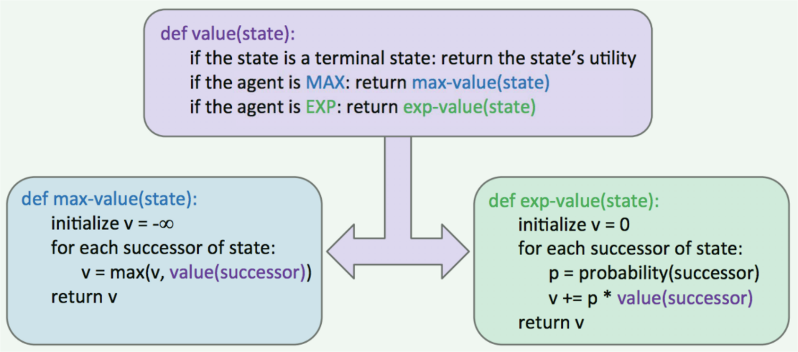
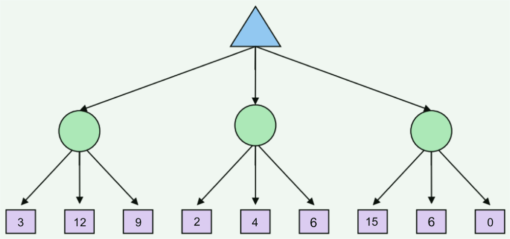
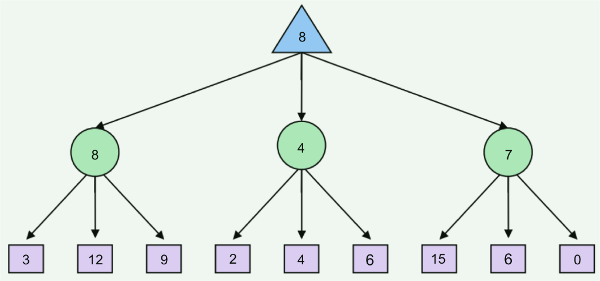

# Game

## Expectimax

我们已经了解了极小化极大算法是如何工作，以及完全极小化极大算法是如何让我们对总是采取最优移动的对手做出最优应对的。然而，极小化极大算法对于它所能应对的情况有一些天然的限制。

因为 minimax 认为其面对的是总采取最优行为的对手，所以其在不能保证对智能体的行为产生最佳应对的情况下，往往过于悲观。这些场景包括具有固有随机性的场景，如：纸牌、骰子游戏，或是随机或次优移动的不可预测对手。

我们会在课程后半段讨论**马尔可夫决策过程**（Markov decision processes）时更详细地讨论具有固有随机性（inherent randomness）的情况。

这种随机性可以通过被称为期望极小化极大（expectimax）的 minimax 的一般化版本来表示。Expectimax 在博弈树中引入**机会节点**（chance nodes），考虑**平均情况**（average case）而不是像极小化节点那样考虑最坏的情况。

更具体地说，最小化者只是计算其子节点的最小效用，而机会节点计算**期望效用**（expected utility）或期望值。Expectimax 确定节点的值的规则如下：

$$
\begin{align}
    \forall \text{ agent-controlled states, } & V(s) = \max_{s' \in successors(s)} V(s') \tag{1} \\
    \forall \text{ chance states, } & V(s) = \sum_{s' \in successors(s)} p(s' | s)V(s') \tag{2} \\
    \forall \text{ terminal states, } & V(s) = known \tag{3} \\
\end{align}
$$

在上述公式中，$ p(s' | s) $ 表示给定的不确定性行为导致从状态 $ s $ 转移到状态 $ s' $ 的概率，或是对手选择的行为导致从状态 $ s $ 转移到状态 $ s' $ 的概率，具体情况取决于博弈的具体情况和所考虑的博弈树。

从这个定义中可以看到，minimax 是 expectimax 的一个特例。极小化节点是平凡的机会节点，其中将概率 1 赋值给具有最小值的子节点，将 0 赋值给所有其他子节点。一般来说，概率被选择来用于正确反映我们试图建模的博弈状态，但我们将在以后的 Note 中更详细地介绍这个过程是如何工作的。

现在，我们可以假设这些概率只是固有的游戏属性。

expectimax 的伪代码和 minimax 的很像，只有一些小的调整用于考虑期望效用而不是最小效用，因为我们已经将最小化节点改为了机会节点。

在我们继续之前，让我们快速地逐步了解一个简单的例子。考虑下面的期望极小化极大树，其中对于最大化者或最小化者而言，机会节点表示为圆圈而不是上下三角。

简单起见，假设机会节点的所有子节点发生的概率为 $\frac{1}{3}$。因此，从我们的期望极大规则来确定值确，我们可以得出从左到右的三个机会节点的值为 $\frac{1}{3} \cdot 3 + \frac{1}{3} \cdot 12 + \frac{1}{3} \cdot 9 = 8, \frac{1}{3} \cdot 2 + \frac{1}{3} \cdot 4 + \frac{1}{3} \cdot 6 = 4, \text{and } \frac{1}{3} \cdot 15 + \frac{1}{3} \cdot 6 + \frac{1}{3} \cdot 0 = 7$

最大化者选择这三个值中的最大值 8，生成的填充完全的博弈树如下所示：

作为期望极大的最后一份笔记，意识到下面这点是很重要的：通常而言，查看机会节点的所有子节点是必要的 —— 我们不能像我们在 minimax 中做的那样剪枝。

与在 minimax 中计算最小值或最大值时不同，单个值可以使 expectimax 计算的期望值任意高或低。然而，当我们知道节点值的可能取值的有限边界时，剪枝是可行的。

> 如果我们知道节点可能的取值边界，那么我们可以通过不等式确定机会节点取值的有限边界，从而尝试进行剪枝。

## Mixed Layer Types

尽管 minimax 和 expectimax 要求 maximizer 节点、minimizer 节点和 maximizer 节点、chance 节点交替出现，但许多博弈仍没有遵循这两种算法所要求的交替模式。

即使在 Pacman 中，在 Pacman 移动后，通常也会有多个 ghost 轮流移动，而不是一个。
