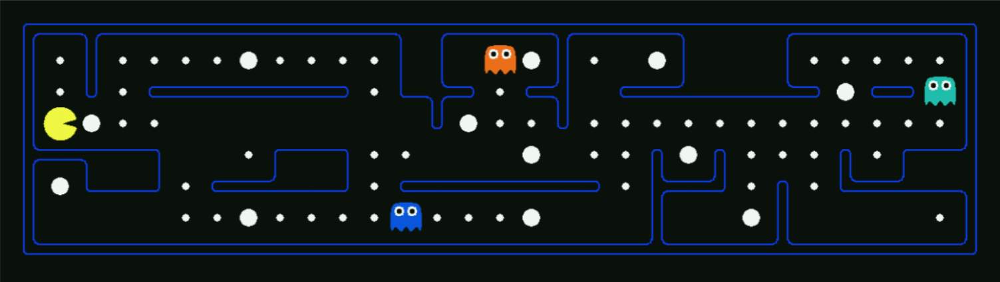

# State Space and Search Problems

> 状态空间和搜索问题

为创建一个理性规划智能体（Rational Planning Agent），我们需要一种数学的方式来表示智能体所存在的给定环境。  
要做到这一点，我们必须形式化的表示一个搜索问题 - 给出智能体的当前状态（其在环境中的配置 - 状况、位置、布局等），我们如何才能用最佳的可能方式，到达一个满足它的目标的新状态？

搜索问题由以下元素组成：

- **状态空间** - 在给定世界中所有可能状态所构成的集合
- 每个状态下，**可取的行动(actions)集合**
- **转移模型** - 在当前状态下执行特定的动作时，输出下一个状态
- **动作代价** - 在执行完一个动作后，从一个状态转移到另一个状态时产生
- **起始状态** - 智能体最初存在时的状态
- **目标检测** - 将状态作为输入，并确定其是否为目标状态的函数

从根本上说，搜索问题可以通过如下步骤解决：首先，考虑起始状态；然后，使用动作、转移和代价方法探索状态空间，迭代地计算不同状态的子状态，直到到达目标状态。此时，我们将确定一条从起始状态到目标状态的路径（通常称为**计划** - plan）。考虑状态的顺序是使用预先给定的策略（strategy）确定的。我们将很快介绍各种策略及其用途。

在我们继续考虑如何求解搜索问题之前，指世界状态（world state）和搜索状态（search state）之间的差异是很重要的。世界状态包含了关于给定状态的所有信息，而搜索状态仅包含用于规划所必须的世界信息（主要是出于空间效率的考虑）。为阐述这些概念，我们将引入这门课的标志性激励示例（the hallmark motivating example）- Pacman（吃豆人）。吃豆人游戏非常简单：Pacman必须穿越迷宫，吃掉迷宫里所有的（小）食物，而不被敌对的巡逻ghosts吃掉。如果Pacman吃了一个（大）能量球，他会在一段固定的时间内免疫ghost的攻击，并且获得吃ghost加分的能力。

考虑该游戏的一个变种，其中迷宫只包含Pacman和食物颗粒。在这种情况下，我们可以提出两种不同的搜索问题：路径选择和吃掉所有食物（Pathing and Eat-all-dots）. Pathing试图解决在迷宫中，如何最优地从 $ (x_1, y_1) $ 点走到 $ (x_2, y_2) $ 点；Eat-all-dots试图解决如何在尽可能短地时间内，将地图中的食物全部吃掉的问题。下面列出了两个问题的状态、动作、转移模型和目标检测：

- Pathing
  - 状态：(x, y)坐标表示的位置
  - 动作：向东、南、西、北方移动
  - 转换函数（得到下一个状态）：仅更新坐标
  - 目标检测：当前坐标(x, y)是否等于终点
- Eat-all-dots
  - 状态：(x, y)坐标表示的位置、该点是否有食物对应的布尔值
  - 动作：向东、南、西、北方移动
  - 转换函数（得到下一个状态）：更新坐标及布尔值
  - 目标检测：所有点的布尔值是否都为false

注意：pathing中的状态相对于eat-all-dots中的状态包含更少的信息。因为对于eat-all-dots问题而言，我们必须维护一个布尔值数组，对应于每个食物颗粒，以及在给定状态下他是否被吃掉。世界状态可能还包含更多的信息，其可能编码诸如Pacman走过的总距离，或是所有Pacmanfan访问过的位置及当前(x, y)坐标与该点的布尔值之类的信息。

## State Space Size

> 状态空间大小

在估计解决搜索问题的计算运行时间时，一个重要的问题是状态空间的大小。该问题几乎完全是通过基本的计数原理（**fundamental counting principle**）来解决的，即如果给定世界中有 $ n $ 个可变对象，他们分别可取 $ x_1, x_2, ..., x_n $ 个不同的值，则状态总数为：$ x_1 · x_2 · ... · x_n $ .&ensp; 让我们以Pacman为例来说明一下这个思想:

假设可变对象及其对应的可能性数量如下：

- Pacman的位置 - Pacman可以位于120个不同的(x, y)坐标上，且只有一个Pacman
- Pacman的朝向 - 共有东、南、西、北四种可能性
- Ghost的位置 - 有两个ghost，每个都可以位于12个不同的(x, y)坐标
- 食物颗粒配置（configurations）- 共三十个食物可莉，每个都有已被吃和未被吃两种状态

使用基本计数原理，Pacman有120种不同的位置，四种不同的朝向，12 · 12种ghost配置（可以理解为位置，每个ghost都有12种），以及 $ 2 · 2 · 2 · ... · 2 = 2^30 $ 种食物颗粒配置（可以理解为状态 - 30个食物都有两种可能值，即已被吃和未被吃）。这给了我们一个总的状态空间大小：$ 120 · 4 · 12^2 · 2^{30} $
