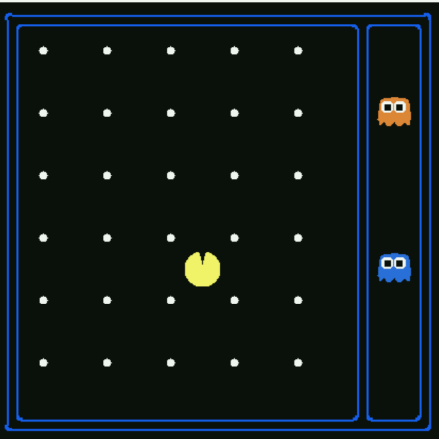

# State Space and Search Problems

> 状态空间和搜索问题

为创建一个**理性规划智能体**（Rational Planning Agent），我们需要一种数学的方式来表示智能体所存在的给定环境。

要做到这一点，我们必须形式化的表示一个**搜索问题**，即：给出智能体的当前状态（其在环境中的配置 - 状况、位置、布局等），我们如何才能用最佳的可能方式，到达一个满足其目标的新状态？

> 这里的搜索问题并非狭义的找到“某种东西”，可以将其理解为找到“某个问题的解”。常见的搜索问题有找到两点间的最短路径、找到函数的最优解等等。
>
> 这些问题从本质上讲，都是试图找到解决某个问题的方案，即plan。而理性的planning agent的目标是用符合理性的决策，一步步的规划行动方案，从而得到一个最优的计划。
>
> 类比与电脑配置，我们通常会以CPU、内存、显卡等硬件设施来描述一台电脑的配置。这里也一样，我们可以用智能体在世界中的坐标、周围的环境、自身硬件的耐久度等等指标来描述智能体的配置。

一个搜索问题由以下四种组件构成：

- **状态空间** - 在给定世界中的所有可能状态所构成的集合
- 每个状态下，**可取的行动(actions)集合**
- **转移模型** - 在当前状态下执行特定的动作时，输出下一个状态
  - 也就是说，转移模型将当前状态和执行的动作映射到一个新的状态
- **动作代价**（action cost） - 在执行完一个动作后，从一个状态转移到另一个状态时产生
  - 对于智能体或者说对于任何食物而言，采取某个行动都是有代价的，这个代价可以是时间的消耗，也可以是体力的损失，甚至更加抽象的影响性能度量的东西
- **起始状态** - 智能体最初存在时的状态
- **目标检测** - 将状态作为输入，并确定其是否为目标状态的函数
  - 返回一个bool值
  - 当然，也可以等价的用目标状态来代替

从根本上说，搜索问题可以通过如下步骤解决：先考虑起始状态；然后，使用行为、转移和代价方法探索状态空间，迭代地计算不同状态的子状态（执行不同动作后，由转移函数得到的新的状态），直到到达目标状态。

在到达目标状态后，考察整个迭代过程，我们将确定一条从起始状态到目标状态的路径（通常称为**计划** - plan）。考虑不同状态的先后顺序是由预先给定的策略（strategy）确定的。我们将很快介绍各种策略及其用途。

> 这里所说的“考虑状态的先后顺序”，可以理解为转移函数并不是直接将当前状态和执行的行为映射到下一个状态的，而是*通过概率的方式，给出到达不同状态的可能性*。
>
> 因此，我们计算当前状态到下一个状态的转移时，并不是简单的计算一个就可以的，而是需要计算所有可能性，这里或许指的是这些可能状态中的考察顺序。
>
> 我们考察一个简单的例子：DFS和BFS的区别。DFS以深度作为首要考虑因素，而BFS则是以广度作为首要的考虑因素，这种策略上的差异导致了二者在探索状态空间时的顺序的差异。
>
> 另外，我们需要明确的是，这样的一条路径是由一些状态以及关联相邻两个状态的动作所构成的。

继续考虑如何求解搜索问题前，指出世界状态（world state）和搜索状态（search state）之间的差异是很重要的：

- **世界状态**包含了关于给定状态的*所有信息*
- **搜索状态**仅包含 *用于规划所必须的* 世界信息
  - 主要出于空间效率的考虑，过多的状态信息不仅会增加存储负担，且会增加计算的复杂性

为阐明这些概念，我们将引入这门课标志性的激励示例（the hallmark motivating example）- Pacman（吃豆人）。

吃豆人游戏非常简单：Pacman必须穿越迷宫，吃掉迷宫里所有的（小）食物，而不被敌对的巡逻ghost吃掉。如果Pacman吃了一个（大）能量球，他会在一段固定的时间内免疫ghost的攻击，并且获得吃掉ghost从而加分的能力。

考虑该游戏的一个变种 —— 迷宫中只有Pacman和食物。这种情况下，我们可以提出两种不同的搜索问题：路径规划和吃掉所有食物（Pathing and Eat-all-dots）. 其中，Pathing问题试图解决如何最优地在迷宫中从 $ (x_1, y_1) $ 点走到 $ (x_2, y_2) $ 点，而Eat-all-dots问题试图解决如何在尽可能短的时间内，将地图中的食物全部吃掉。

下面列出这两个问题的状态、动作、转移模型和目标检测：

- Pathing
  - *状态*：(x, y)坐标表示的位置
  - *动作*：向东、南、西、北方移动
  - *转换函数*（得到下一个状态）：仅更新坐标
  - *目标检测*：当前坐标(x, y)是否等于终点
- Eat-all-dots
  - *状态*：(x, y)坐标表示的位置、表示该点上的食物是否被吃掉的bool值
  - *动作*：向东、南、西、北方移动
  - *转换函数*（得到下一个状态）：更新坐标及点的布尔值
  - *目标检测*：所有点的布尔值是否都为false

注意：pathing中的状态相对于eat-all-dots中的包含的信息更少。这是因为，对eat-all-dots而言。我们必须维护一个bool数组，其对应于每个食物，以及在给定状态下他是否被吃掉。

> 也就是说，对于不同的场景下，或者说对于不同的规化目标，同一个世界中的智能体的搜索状态也可能不同，具体服务于规划的需要。

正如前面所说的那样，世界状态可能还包含更多的信息。例如：其可能编码诸如Pacman走过的总距离、所有Pacman访问过的位置及当前(x, y)坐标与该点的布尔值之类的信息。

## State Space Size

> 状态空间大小

在估算解决搜索问题所需的计算上的运行时间（the computational runtime）时，一个重要的问题是**状态空间的大小**。

该问题几乎完全是通过基本计数原理（**fundamental counting principle**）来解决的，即：如果给定世界中有 $ n $ 个变量，他们分别可取 $ x_1, x_2, ..., x_n $ 个不同的值，则状态总数为：$ x_1 · x_2 · ... · x_n $

让我们以Pacman为例，来说明一下该理论。

假设变量及其对应的可能取值数量如下：

- Pacman的位置 - Pacman可以位于120个不同的(x, y)坐标上，且只有一个Pacman
- Pacman的朝向 - 共有东、南、西、北四种可能
- Ghost的位置 - 有两个ghost，每个都可位于12个不同的(x, y)坐标上
- 食物配置（configurations）- 共三十个食物，每个都有已被吃和未被吃两种状态

使用基本计数原理，Pacman有120种不同的位置，4种不同的朝向；ghosts有12 · 12种配置（可以理解为位置，每个ghost都有12种），以及 $ 2 · 2 · ... · 2 = 2^30 $ 种食物配置（可以理解为状态 - 30个食物都有两种可能值，即已被吃和未被吃）。由此可以计算出总状态空间的大小：$ 120 · 4 · 12^2 · 2^{30} $

## State Space Graphs and Search Trees

> 状态空间图和搜索树

既然我们已经建立了状态空间的概念和完整定义它所必须的四个组件，那我们几乎已经可以着手解决搜索问题了。但在真正开始之前，我们需要指出与该问题相关的最后一部分内容：状态空间图和搜索树。

回想一下，图是由节点集和关联不同节点对的边集所构成的，这些边可能还有与之关联的权值。（无权图 and 有权图、无向图 and 有向图）

**状态空间图**是由表示节点的状态，和从一个状态指向其子状态的有向边构成。这些边表示动作，任何与之关联的权值表示执行相应动作的代价。

通常因为状态空间图太大，所以不能存储在内存中（即使是上面提到的简单的Pacman例子也有将近 $ 10^{13} $ 种可能状态）。但是解决实际问题时，在概念上记住它们是有好处的。

同样值得重视的是，在状态空间图中，每种状态只能表示一次 —— 根本没必要多次表示同一个状态，了解这点对推理搜索问题很有帮助。

> 在状态空间图中，我们更多的是描述不同状态之间的联系，即一个状态能否到达另一个状态。如果能，那么如何行动才能到达？这个行动的代价是什么？
>
> 有点类似于Top-Sort中的AOE(Action On Edge)网络

与状态空间图不同，下一个感兴趣的结构 - **搜索树**，对状态出现的次数没有这样的限制。这是因为尽管搜索树也是一类用状态表示节点，动作表示状态之间的边的图，但是每一个状态（节点）不仅编码了状态本身，还编码了状态空间图中从开始状态到指定状态的整个路径（或计划plan）

> 从树的角度来说，从根节点到任一子孙节点的所有可能路径都蕴含在树所表示的信息中。

观察下面的状态空间图和相应的搜索树：

给出的状态空间图中高亮显示的路径（ $ S \rightarrow d \rightarrow e \rightarrow r \rightarrow f \rightarrow G $ ）在相应的搜索树中，表示为从起始状态 $ S $ 到高亮显示的目标状态 $ G $ 的路径。

类似地，从开始节点到任一其它节点的路径在搜索树中，都是用从根节点 $ S $ 到与另一个节点对应的根的子孙节点的路径来表示。由于从一个状态到另一个状态的路径通常有多条，状态往往会在搜索树中出现多次。因此，搜索树的大小通常大于等于相应的状态空间图。

我们已经确定，即使对于简单的问题，状态空间图的规模都可能非常庞大。因此问题来了，如果因为这些结构太大而无法在内存中表示，那我们该如何在其上执行有用的计算？答案在于我们如何计算当前状态的子状态 —— 只存储需要立即处理的状态，并使用相应的 getNextState, getAction, getActionCost方法来计算新的状态。

> 这是一种很好的想法，在很多时候我们通常并不需要考虑问题的全貌，而是通过处理一个一个独立的部分从而求出问题的解。
>
> 这样的一种思想与动态规划体现的思想类似，在动态规划中，有时我们会使用 $ f[2][n] $ 这样的数组来存储迭代时的计算结果，在这里，每一个状态只与上一个状态有关，因此只需要存储相邻两状态即可。
>
> 当然，在实际使用中，我们还需要考虑这种step-by-step的方法是否能得到想要的解，但这并不是我们现在需要考虑的。

通常，搜索问题是用搜索树来解决的。在搜索树中，我们会非常仔细的选择一些节点来存储以便于一次观测，然后迭代地用他们的子节点替换节点，直到到达目标状态。

决定搜索树节点地迭代替换的顺序的方法有很多，现在我们将介绍这些方法。

## Uninformed Search

> 无信息搜索

