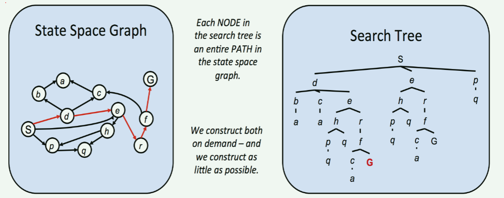
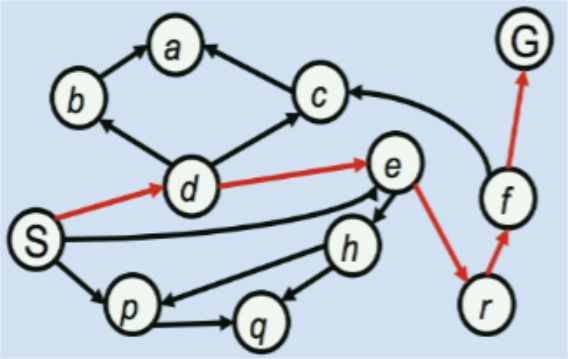
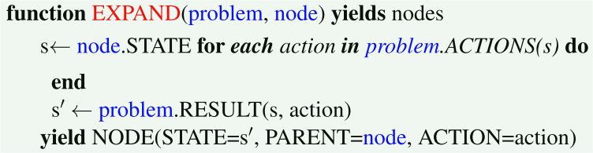
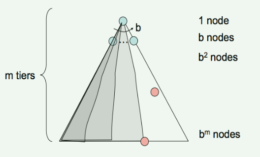
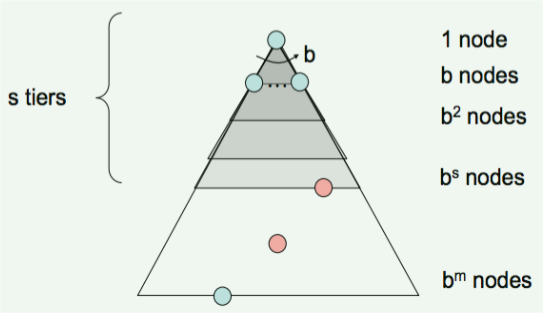
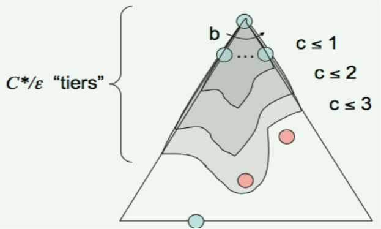

# State Space and Search Problems

> 状态空间和搜索问题

为创建一个**理性规划智能体**（Rational Planning Agent），我们需要一种数学的方式来表示智能体存在的环境。

要做到这一点，我们必须 *形式化* 的表示一个**搜索问题**，即：给出智能体的当前状态（其在环境中的配置 - 状况、位置、布局等），我们如何才能用最佳的可能方式，到达一个满足其目标的新状态？

> 这里的搜索问题并非狭义的找到 “某种东西”，可以将其理解为找到 “某个问题的解”，常见的搜索问题有找到两点间的最短路径、找到函数的最优解等等。
>
> 这些问题从本质上讲，都是试图找到解决某个问题的方案，即plan。而**理性**的planning agent的目标是用符合理性的决策，一步步的规划行动方案，从而得到一个最优的计划。
>
> 类比电脑配置，我们通常会以CPU、内存、显卡等硬件设施来描述一台电脑的配置。这里也一样，我们可以用智能体在世界中的坐标、周围的环境、自身硬件的耐久度等等指标来描述智能体的配置。

一个搜索问题由以下四种 *组件* 构成：

- **状态空间** - 在给定世界中的所有可能状态所构成的集合
- 每个状态下，**可取的行动(actions)集合**
- **转移模型** - 在当前状态下执行特定的动作时，输出下一个状态
  - 也就是说，转移模型将当前状态和执行的动作映射到一个新的状态
- **动作代价**（action cost） - 在执行完一个动作后，从一个状态转移到另一个状态时产生
  - 对于智能体或者说对于任何食物而言，采取某个行动都是有代价的，这个代价可以是时间的消耗，也可以是体力的损失，甚至更加抽象的影响性能度量的东西
- **起始状态** - 智能体最初存在时的状态
- **目标检测** - 将状态作为输入，并确定其是否为目标状态的函数
  - 返回一个bool值
  - 当然，也可以等价的用目标状态来代替

从根本上说，搜索问题可以通过如下步骤解决：先考虑起始状态；然后，使用行为、转移和代价方法探索状态空间，迭代地计算不同状态的子状态（执行不同动作后，由转移函数得到的新的状态），直到到达目标状态。

在到达目标状态后，考察整个迭代过程，我们将确定一条从起始状态到目标状态的路径（通常称为**计划** - plan）。考虑不同状态的先后顺序是由预先给定的策略（strategy）确定的。我们将很快介绍各种策略及其用途。

> 这里所说的“考虑状态的先后顺序”，可以理解为转移函数并不是直接将当前状态和执行的行为映射到下一个状态的，而是*通过概率的方式，给出到达不同状态的可能性*。
>
> 因此，我们计算当前状态到下一个状态的转移时，并不是简单的计算一个就可以的，而是需要计算所有可能性，这里或许指的是这些可能状态中的考察顺序。
>
> 我们考察一个简单的例子：DFS和BFS的区别。DFS以深度作为首要考虑因素，而BFS则是以广度作为首要的考虑因素，这种策略上的差异导致了二者在探索状态空间时的顺序的差异。
>
> 另外，我们需要明确的是，这样的一条路径是由一些状态以及关联相邻两个状态的动作所构成的。

继续考虑如何求解搜索问题前，指出世界状态（world state）和搜索状态（search state）之间的差异是很重要的：

- **世界状态**包含了关于给定状态的*所有信息*
- **搜索状态**仅包含 *用于规划所必须的* 世界信息
  - 主要出于空间效率的考虑，过多的状态信息不仅会增加存储负担，且会增加计算的复杂性

为阐明这些概念，我们将引入这门课标志性的激励示例（the hallmark motivating example）- Pacman（吃豆人）。

吃豆人游戏非常简单：Pacman必须穿越迷宫，吃掉迷宫里所有的（小）食物，而不被敌对的巡逻ghost吃掉。如果Pacman吃了一个（大）能量球，他会在一段固定的时间内免疫ghost的攻击，并且获得吃掉ghost从而加分的能力。

考虑该游戏的一个变种 —— 迷宫中只有Pacman和食物。这种情况下，我们可以提出两种不同的搜索问题：路径规划和吃掉所有食物（Pathing and Eat-all-dots）. 其中，Pathing问题试图解决如何最优地在迷宫中从 $ (x_1, y_1) $ 点走到 $ (x_2, y_2) $ 点，而Eat-all-dots问题试图解决如何在尽可能短的时间内，将地图中的食物全部吃掉。

下面列出这两个问题的状态、动作、转移模型和目标检测：

- Pathing
  - *状态*：(x, y)坐标表示的位置
  - *动作*：向东、南、西、北方移动
  - *转换函数*（得到下一个状态）：仅更新坐标
  - *目标检测*：当前坐标(x, y)是否等于终点
- Eat-all-dots
  - *状态*：(x, y)坐标表示的位置、表示该点上的食物是否被吃掉的bool值
  - *动作*：向东、南、西、北方移动
  - *转换函数*（得到下一个状态）：更新坐标及点的布尔值
  - *目标检测*：所有点的布尔值是否都为false

注意：pathing中的状态相对于eat-all-dots中的包含的信息更少。这是因为，对eat-all-dots而言。我们必须维护一个bool数组，其对应于每个食物，以及在给定状态下他是否被吃掉。

> 也就是说，对于不同的场景下，或者说对于不同的规化目标，同一个世界中的智能体的搜索状态也可能不同，具体服务于规划的需要。

正如前面所说的那样，世界状态可能还包含更多的信息。例如：其可能编码诸如Pacman走过的总距离、所有Pacman访问过的位置及当前(x, y)坐标与该点的布尔值之类的信息。

## State Space Size

> 状态空间大小

在估算解决搜索问题所需的计算上的运行时间（the computational runtime）时，一个重要的问题是**状态空间的大小**。

该问题几乎完全是通过基本计数原理（**fundamental counting principle**）来解决的，即：如果给定世界中有 $ n $ 个变量，他们分别可取 $ x_1, x_2, ..., x_n $ 个不同的值，则状态总数为：$ x_1 · x_2 · ... · x_n $

让我们以Pacman为例，来说明一下该理论。

假设变量及其对应的可能取值数量如下：

- Pacman的位置 - Pacman可以位于120个不同的(x, y)坐标上，且只有一个Pacman
- Pacman的朝向 - 共有东、南、西、北四种可能
- Ghost的位置 - 有两个ghost，每个都可位于12个不同的(x, y)坐标上
- 食物配置（configurations）- 共三十个食物，每个都有已被吃和未被吃两种状态

使用基本计数原理，Pacman有120种不同的位置，4种不同的朝向；ghosts有12 · 12种配置（可以理解为位置，每个ghost都有12种），以及 $ 2 · 2 · ... · 2 = 2^30 $ 种食物配置（可以理解为状态 - 30个食物都有两种可能值，即已被吃和未被吃）。由此可以计算出总状态空间的大小：$ 120 · 4 · 12^2 · 2^{30} $

## State Space Graphs and Search Trees

> 状态空间图和搜索树

既然我们已经建立了状态空间的概念和完整定义它所必须的四个组件，那我们几乎已经可以着手解决搜索问题了。但在真正开始之前，我们需要指出与该问题相关的最后一部分内容：状态空间图和搜索树。

回想一下，图是由节点集和关联不同节点对的边集所构成的，这些边可能还有与之关联的权值。（无权图 and 有权图、无向图 and 有向图）

**状态空间图**是由表示节点的状态，和从一个状态指向其子状态的有向边构成。这些边表示动作，任何与之关联的权值表示执行相应动作的代价。

通常因为状态空间图太大，所以不能存储在内存中（即使是上面提到的简单的Pacman例子也有将近 $ 10^{13} $ 种可能状态）。但是解决实际问题时，在概念上记住它们是有好处的。

同样值得重视的是，在状态空间图中，每种状态只能表示一次 —— 根本没必要多次表示同一个状态，了解这点对推理搜索问题很有帮助。

> 在状态空间图中，我们更多的是描述不同状态之间的联系，即一个状态能否到达另一个状态。如果能，那么如何行动才能到达？这个行动的代价是什么？
>
> 有点类似于Top-Sort中的AOE(Action On Edge)网络

与状态空间图不同，下一个感兴趣的结构 - **搜索树**，对状态出现的次数没有这样的限制。这是因为尽管搜索树也是一类用状态表示节点，动作表示状态之间的边的图，但是每一个状态（节点）不仅编码了状态本身，还编码了状态空间图中从开始状态到指定状态的整个路径（或计划plan）

> 从树的角度来说，从根节点到任一子孙节点的所有可能路径都蕴含在树所表示的信息中。

观察下面的状态空间图和相应的搜索树：

给出的状态空间图中高亮显示的路径（ $ S \rightarrow d \rightarrow e \rightarrow r \rightarrow f \rightarrow G $ ）在相应的搜索树中，表示为从起始状态 $ S $ 到高亮显示的目标状态 $ G $ 的路径。

类似地，从开始节点到任一其它节点的路径在搜索树中，都是用从根节点 $ S $ 到与另一个节点对应的根的子孙节点的路径来表示。由于从一个状态到另一个状态的路径通常有多条，状态往往会在搜索树中出现多次。因此，搜索树的大小通常大于等于相应的状态空间图。

我们已经确定，即使对于简单的问题，状态空间图的规模都可能非常庞大。因此问题来了，如果因为这些结构太大而无法在内存中表示，那我们该如何在其上执行有用的计算？答案在于我们如何计算当前状态的子状态 —— 只存储需要立即处理的状态，并使用相应的 getNextState, getAction, getActionCost方法来计算新的状态。

> 这是一种很好的想法，在很多时候我们通常并不需要考虑问题的全貌，而是通过处理一个一个独立的部分从而求出问题的解。
>
> 这样的一种思想与动态规划体现的思想类似，在动态规划中，有时我们会使用 $ f[2][n] $ 这样的数组来存储迭代时的计算结果，在这里，每一个状态只与上一个状态有关，因此只需要存储相邻两状态即可。
>
> 当然，在实际使用中，我们还需要考虑这种step-by-step的方法是否能得到想要的解，但这并不是我们现在需要考虑的。

通常，搜索问题是用搜索树来解决的。在搜索树中，我们会非常仔细的选择一些节点来存储以便于一次观测，然后迭代地用他们的子节点替换节点，直到到达目标状态。

决定搜索树节点地迭代替换的顺序的方法有很多，现在我们将介绍这些方法。

## Uninformed Search

> 无信息搜索

寻找一条从起始状态到目标状态的路径(plan)的标准方案(the standard protocol)是维护从搜索树派生出的部分路径的外部边界(an outer **frontier** of partial plans).

我们通过从**边界**中移除与部分路径相对应的节点（使用给定策略选择出的），并用它的所有子节点在边界上代替它，从而不断扩展边界。

> 这样的一个描述非常抽象，我们以BFS为例，在下面给出的状态空间图中重述一下该过程：
>
> 
>
> 在上图中，以S为start state，G为goal state，我们的目标是找到一条从S到G的路径。
>
> 在BFS中，考察第二次迭代开始时的情况，即此时已考虑完起始状态S，并将d, e, p三个状态加入待考虑集合。  
> 我们可以将集合理解为所谓外部边界，整个S -> d, S -> e, S -> p可以理解为部分路径的集合 —— 准确来说应该是从起始状态到任何一个中间状态的路径都可以称之为部分路径partial plan，并且需要考虑的部分路径不止一条！  
> 这样一来，我们就能将与部分路径相对应的节点理解为该路径的终点，从而在外部边界中处理这些节点。  
> 处理的结果应为：外边界 - {b, c, h ,r, q}; 部分路径 - {S -> d -> b, S -> d -> c, S -> e -> h, S -> e -> r, S -> p -> q}
>
> 补充一点，可以视初始状态为：外边界 - {S}; 部分路径 - {S}

移除并用子节点替换边界上的元素对应于放弃所有单个长度为 $ n $ 的路径，并将所有源于它的长度为 $ (n + 1) $ 的路径纳入考虑范围。

持续该过程直到**最终将目标状态从边界中移除**。此时，我们可以断定与被移除的目标状态相对应的部分路径，实际上就是从开始状态到目标状态的路径，也即待求路径。

实际上，此类算法的大多数实现会编码关于父节点、到节点的距离(边权)以及节点对象内部状态的信息。我们刚刚描述的这个过程称为*树搜索(Tree Search)*，其伪代码如下所示：

伪代码中出现的 $ \text{EXPAND} $ 函数通过考察所有可用行动，返回可以从给定节点到达的所有可能节点。该函数的伪代码如下：

> *生成(yield)*: 包含关键字 yield 的函数称为生成器 generator，生成器可以生成一个值序列，每执行到一个 yield 表达式时生成一个值。然后从 yield 的下一个语句开始继续执行。

当我们不知道目标状态在搜索树中的位置时，我们不得不从属于无信息搜索(uninformed search)领域的技术中，选择一种作为树搜索(tree search)的策略。

下面我们将依次介绍三个这样的策略(strategy): depth-first search, breadth-first search, and uniform cost search。（DFS深度优先搜索，BFS广度优先搜索，UCS一致代价搜索）

除了策略本身外，还介绍了它们的一些基本属性(some rudimentary properties of the strategy)，如下所示：

- **完备性**(completeness)：如果存在搜索问题的解，在给定足够多的计算资源的情况下，该策略能保证找到它吗？
- **最优性**(optimality)：该策略能保证找出到达一个目标状态的最小代价路径吗？
- **分支因子 $ b $**(branching factor)：每次边界节点退出队列并用其子节点替换时，边界上的节点数的增量为 $ O(b) $ - 即最多增加 $ b $ 个节点。在搜索树的第 $ k $ 层上，存在 $ O(b^k) $ 个节点。
- **最大深度 $ m $**(the maximum depth)
- **最优解的深度**（The depth of the shallowest solution $ s $）

### Depth-First Search

> 深度优先搜索

#### 概述（Description）

DFS是一种总选择相对于起始节点最深的边界节点来扩张(expansion)的搜索策略。

#### 边界表示（Frontier Representation）

在边界中删除节点，并使用它的子节点替换它。这必然导致新加入的子节点将成为新的最深节点，因为它们的深度比之前的最深节点大1。

这意味着要实现DFS算法，我们需要一种总是给最新添加的对象最高优先级的数据结构。具有后进先出(LIFO)性质的栈(stack)正是这样做的，并且这也是实现DFS时传统上用于表示边界的结构。

> 所谓的Frontier Representation指的是找到一种合适的数据结构来存储边界，以更好地服务于我们的策略。

#### 完备性（Completeness）

DFS不是完备的。如果状态空间图中存在环，这样的一个迭代过程意味着在相应的搜索树将具有无限大的深度。因此，DFS可能忠实地但不幸地(faithfully and tragically)陷入到在无限大的搜索树中寻找最深节点的困境中，注定永远不会找到一个解。

> 当然，如果我们仅仅考虑可达这样一种性质（也即搜索问题中 $ EXPAND $ 函数考虑所有可以到达新节点的Action），此时我们会陷入环中“无法自拔”。  
> 但是，如果我们检查到达的新节点是否已经被访问过了，那么我们并不会陷入环中。而实际编程中，我们也是这样做的。
>
>在我们所定义的搜索问题中，并不考虑这些因素，因为定义中搜索问题只有六个组件：状态空间、可选动作空间、转移函数、起始状态、目标检测、动作代价。  
> 有限的工具不支持我们对其进行过多的优化。
>
> 这样来说，完备性是否并不是绝对的？或者说，可能存在某种方法使不完备的策略变得完备？

#### 最优性（Optimality）

DFS只是在搜索树中简单地找到“最左边”的解，而不考虑路径代价，因此不是最优的。

> 从上面的搜索树中也可以看出，DFS会找到所有可能路径中最左边的那条，并将其作为结果输出，但这显然是不合理的，因为其没有考虑所有可能的到达目标状态的路径，并从中找出代价最小的一条。（当然，在“同样左”的位置，DFS会输出最短的那条）
>
> 我们也可以采取随机化的方法，来安排当存在多个最深节点时的扩张顺序。

#### 时间复杂性（Time Complexity）

最坏情况下，DFS可能在探索完整个搜索树之后才终止。因此，给定一个最大深度为 $ m $ 的搜索树，DFS的运行时间为 $ O(b^m) $。

#### 空间复杂性（Space Complexity）

最坏情况下，DFS在深度为 $ m $ 的边界上，每层维护 $ b $ 个节点。这是一个简单的结果，因为一旦某个父结点的 $ b $ 个子节点入队了，DFS本质上只允许在任何给定时间点上，探索这些子节点的一个子树。因此，DFS的空间复杂性为 $ O(bm) $。

### Breadth-First Search

> 广度优先搜索

#### 概述

BFS是一种总选择相对于起始节点最浅的边界节点来扩张的搜索策略。

> 与DFS相对

#### 边界表示

如果我们想在访问较深的节点前，先访问完所有相对更浅的节点，我们必须根据节点插入边界集合的顺序来访问它们。（因为每次插入边界的节点一定比从边界中删除的节点更深，所以应该按照插入边界的先后顺序来访问 —— 越早插入的越先访问）

因此，我们需要一个输出最早入队的对象（the oldest enqueued object）的数据结构来表示边界。为此，BFS使用具有先进先出(FIFO)特性的队列结构来实现。

#### 完备性

如果解存在，那么最浅的目标状态对应的节点 $ s $ 的深度一定是有限的。因此，BFS最终一定会搜索到这个深度。故，其是完备的。

> 注意：完备性考察的是，如果解存在，是否能在有限时间内找到它。

#### 最优性

BFS通常不是最优的，因为在确定替换边界上的哪个节点时，它根本不考虑代价。—— 与DFS类似，这两种方法都是从节点的深度来考虑优先replace哪个节点。

> 注意：BFS保证的是找到到达最浅目标节点的路径，这只意味着路径的深度最小，并不一定是代价最小！！！

**保证BFS的最优性的特殊情况是所有边缘（动作）的代价相等，因为此时BFS退化为UCS（Uniform Cost Search）的一种特殊情况**，这将在后文讨论。

#### 时间复杂性

最坏情况下，因为我们需要遍历深度从1 ~ s的每一层的所有节点，所以必须搜索 $ 1 + b + b^2 + ... + b^s $ 个节点。

因此，时间复杂性为 $ O(b^s) $。

#### 空间复杂性

最坏情况下，边界集合中包含了与最浅解对应的层中的所有节点。假设最浅的解深度为 $ s $，在该深度上有 $ O(b^s) $ 个节点。

### Uniform Cost Search

> 一致代价搜索

#### Description

最后一个策略 —— UCS（一致代价搜索），总选择从起始节点到所有边界节点中代价最小的节点用于扩张。

> 上述三种策略都提到了一个相对于起始节点的概念，一般情况下，状态之间是双向联通的（即可从A到B，或从B到A），因此，相对这个概念的提出是有意义的。

#### Frontier Representation

为表示UCS的边界，通常的选择是基于堆的优先队列。其中，优先级是根据给定入队节点 $ v $ 相应的从开始节点到 $ v $ 的路径代价，或后向代价来确定的。

> 注意：UCS中的优先级是从起始节点到给定节点的总路径代价

直观地说，通过这种方式构建地优先队列在删除当前代价最小的**路径**，并用它的 *子路径*（即添加后继节点后的路径）替换时，会重新排序以维护路径代价的期望顺序。

#### Completeness

UCS是完备的。如果存在一个目标状态，则一定存在一些有限长度的最短路径。因此，UCS最终一定会找到这个最短长度路径。

#### Optimality

如果我们假设所有边的代价是非负的，那么UCS也是最优的。由于算法设计中是按照**路径代价递增的顺序**来探索节点的，因此能确保找到通向目标状态的代价最小的路径。—— 负代价路径会破坏递增的性质！

> 注意强调的是路径！！！

**一致代价搜索采用的策略与Dijkstra算法相同**，主要区别在于UCS找到一个目标状态后就终止，而不是找到所有状态的最短路径。

> 实际在解题中，我们或许已经用过UCS而不自知。

注意：图中若有负权值边，则会导致路径长度减小，从而不能保证结果一定是最优。（可能出现某条路径在加入负权值边后成为实际上的最短路径，但该条路径在被考虑之前就已经因为前驱路径过长而pass了）—— 对于这种可能性，可以查阅较慢但能解决问题的Bellman-Ford算法, $ O(V \cdotp E) $。当然，Floyd-Warshall算法也可以解决该问题。

#### Time Complexity

定义最优路径代价为 $ C^* $，状态空间图中两节点间的最小代价为 $ \epsilon $。因为必须大致搜索完深度从1到 $ \frac{C^*}{\epsilon} $ 的所有节点，所以运行时间为 $ O(b^{\frac{C^*}{\epsilon}}) $。

#### Space Complexity

粗略地说，边界将包含代价最小地解相应层次上的所有节点，因此USC的空间复杂度大致为 $ O(b^{\frac{C^*}{\epsilon}}) $。

**Parting Note**（临别赠言）：关于无信息搜索，有一点非常重要，上面列出的三种策略本质上是相同的 —— 只是在扩张策略上有所不同，它们的相似之处体现在上面的树搜索伪代码中。

> 只在选择优先扩张的节点上有所不同，DFS选择深度最深的，BFS选择深度最浅的，UCS选择代价最小的。
