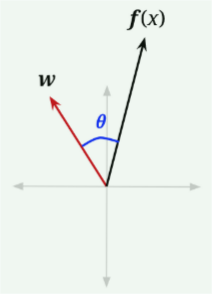

# Perceptron

> 感知器

## Linear Classifiers

> 线性分类器

朴素贝叶斯的核心思想是从训练数据中提取某些称为特征（features）的属性，然后评估给定特征的标签的概率：$P(y | f_1, f_2, ..., f_n)$。因此，给定一个新数据点，我们可以提取出相应的特征，然后将该数据点分类为给定这些特征的最大概率的标签。

然而这需要我们估计分布（我们用 MLE 做的）。如果我们不估计概率分布呢？让我们从一个简单的线性分类器开始，我们可以用它来执行二分类（binary classification），也就是说标签有两种可能性：正或负（positive or negative）

线性分类器的基本想法是使用特征的线性组合（我们称为激活 activation 的值）来进行分类。具体而言，激活函数以一个数据点为输入值，将该数据点的每个特征 $f_i(x)$ 乘以相应的权重 $w_i$，输出所有结果值的总和。

在向量形式中，我们也可以把它写成权重向量 $w$ 和数据点的特征向量 $f(x)$ 的点积：

$$\text{activation}_w(\mathbf{x}) = \sum_i{w_if_i(x)} = \mathbf{w}^T\mathbf{f(x)} = \mathbf{w} \cdot \mathbf{f(x)}$$

如何使用激活函数来分类呢？对于二分类而言，当一个数据点的激活函数值为正时，我们使用正标签对其进行分类；如果其为负，则使用负标签。

$$
\text{classify}(\mathbf{x}) = \left\{ \begin{array}{ll}
    + & \text{if } h_{\mathbf{w}}(\mathbf{x}) > 0 \\
    - & \text{if } h_{\mathbf{w}}(\mathbf{x}) < 0 \\
\end{array} \right.
$$

为了从几何上理解这一点，让我们重新考察激活函数的向量形式。我们可以将点积重写为以下形式，其中 $||\cdot||$ 是模长算子、$\theta$ 是 $\mathbf{w}$ 和 $\mathbf{f(x)}$ 之间的夹角：

$$h_{\mathbf{w}}(\mathbf{x}) = \mathbf{w} \cdot \mathbf{f(x)} = ||\mathbf{w}||\space ||\mathbf{f(x)}||\space cos(\theta)$$

因为模长总是非负的，并且我们的分类规则考察激活函数值的正负，所以对决定类有影响的唯一项是 $cos(\theta)$。

$$
\text{classify}(\mathbf{x}) = \left\{ \begin{array}{ll}
    + & \text{if } cos(\theta) > 0 \\
    - & \text{if } cos(\theta) < 0 \\
\end{array} \right.
$$

因此，我们感兴趣的是 $cos(\theta)$ 的正负。容易看到，对于 $\theta < \frac{\pi}{2}$
