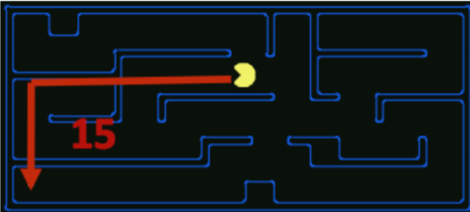

# 有信息搜索（Informed Search）

UCS是一种好的搜索算法，因为它不仅完备而且最优。但是，它可能相当慢，因为在搜索目标的过程中，它从起始状态向各个方向扩张。

> 因为没有目标状态的其余附加信息，所以需要使用遍历的方式来查找是否存在目标状态，因此较慢。

如果我们对搜索时需要重点关注的方向有一些概念（目标所处的方位），就可以显著提高性能，并且更快 “逼近” 目标。这正是有信息搜索的重点。

## 启发式（Heuristics）

启发式是允许评估到目标状态的距离的驱动力 —— 它们是以状态作为输入，并输出相应适应值的函数。由这样一个函数执行的计算是特定于要解决的搜索问题的。

> 适应值一般用来评价解的质量（好坏）
>
> 常用的距离度量方式有：Euclidean distance、Mahalanobis distance、Manhattan distance and Hamming distance etc. 这些距离度量方式都可以作为启发式函数。

由于一些原因（将在下面的 $ A^* $ 搜索算法中讨论），我们通常希望启发式函数是到目标的剩余距离的一个下界。因此，启发式通常可作为松弛问题的解法 - solutions to relaxed problems（其中原始问题的一些约束已被删除）。

> 在最短路径问题中，我们已经接触过 “松弛” 这个概念，松弛指的是在当前已知信息的基础上，尽可能地放宽约束，以期望获得更好的解决方案。
>
> 当然，这个最好是有标准的，衡量一个好的解决方案的方式就是启发式函数。

回到Pacman例子，考虑之前描述的路径问题。用于解决该问题的一个常见启发式是Manhattan距离，对于 $ (x_1, y_1),\space (x_2, y_2) $ 两点，其定义如下：

$$ Manhattan(x_1, y_1, x_2, y_2) = |x_1 - x_2| + |y_1 - y_2| $$

上图可视化的显示了Manhattan距离帮助解决的松弛问题 —— 假设Pacman想去迷宫的左下角，其计算了在迷宫中没有墙壁的情况下Pacman当前位置到预期位置的距离。该距离正是松弛搜索问题中的精确(exact)目标距离，与之对应的是实际搜索问题中的估计(estimated)目标距离。

有了启发式，在智能体中非常容易实现这样的逻辑：使智能体在决定执行哪个动作时，能 “倾向于” 扩张评估结果离目标状态更近（一般而言，对应于适应值更小）的状态。

这种偏好（preference）的理论非常强大，并被以下两种实现启发式函数的搜索算法所利用：贪心搜索和 $ A^* $。

## 贪心搜索（Greedy Search）

### Description

贪心搜索是一种总选择具有**最小启发式值**（the lowest heuristic value）的边界节点，对应于它认为离目标最近的状态，用于扩展的探索策略。

### Frontier Representation

贪心搜索与UCS的操作一致，均使用优先队列表示边界。
