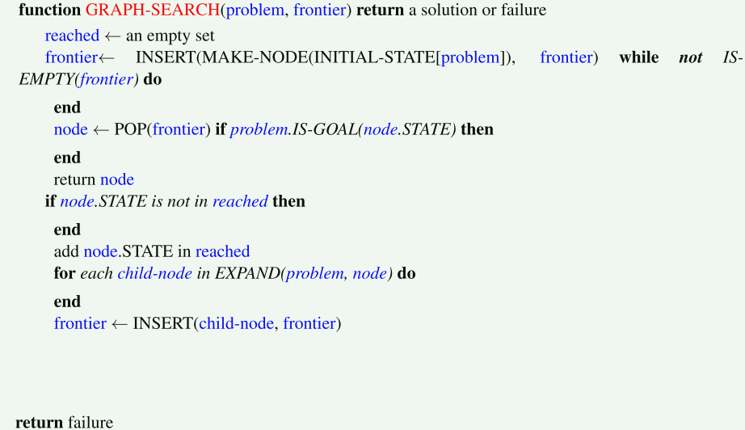

# 有信息搜索（Informed Search）

UCS是一种好的搜索算法，因为它不仅完备而且最优。但是，它可能相当慢，因为在搜索目标的过程中，它从起始状态向各个方向扩张。

> 因为没有目标状态的其余附加信息，所以需要使用遍历的方式来查找是否存在目标状态，因此较慢。

如果我们对搜索时需要重点关注的方向有一些概念（目标所处的方位），就可以显著提高性能，并且更快 “逼近” 目标。这正是有信息搜索的重点。

## 启发式（Heuristics）

启发式是允许评估到目标状态的距离的驱动力 —— 它们是以状态作为输入，并输出相应适应值的函数。由这样一个函数执行的计算是特定于要解决的搜索问题的。

> 适应值一般用来评价解的质量（好坏）
>
> 常用的距离度量方式有：Euclidean distance、Mahalanobis distance、Manhattan distance and Hamming distance etc. 这些距离度量方式都可以作为启发式函数。

由于一些原因（将在下面的 $ A^* $ 搜索算法中讨论），我们通常希望**启发式函数是到目标的剩余距离的一个下界**。因此，启发式通常可作为松弛问题的解法 - solutions to relaxed problems（其中原始问题的一些约束已被删除）。

> 在最短路径问题中，我们已经接触过 “松弛” 这个概念，松弛指的是在当前已知信息的基础上，尽可能地放宽约束，以期望获得更好的解决方案。
>
> 当然，这个最好是有标准的，衡量一个好的解决方案的方式就是启发式函数。

回到Pacman例子，考虑之前描述的路径问题。用于解决该问题的一个常见启发式是Manhattan距离，对于 $ (x_1, y_1),\space (x_2, y_2) $ 两点，其定义如下：

$$ Manhattan(x_1, y_1, x_2, y_2) = |x_1 - x_2| + |y_1 - y_2| $$

上图可视化的显示了Manhattan距离帮助解决的松弛问题 —— 假设Pacman想去迷宫的左下角，其计算了在迷宫中没有墙壁的情况下Pacman当前位置到预期位置的距离。该距离正是松弛搜索问题中的精确(exact)目标距离，与之对应的是实际搜索问题中的估计(estimated)目标距离。

有了启发式，在智能体中非常容易实现这样的逻辑：使智能体在决定执行哪个动作时，能 “倾向于” 扩张评估结果离目标状态更近（一般而言，对应于适应值更小）的状态。

这种偏好（preference）的理论非常强大，并被以下两种实现启发式函数的搜索算法所利用：贪心搜索和 $ A^* $。

## 贪心搜索（Greedy Search）

### Description

贪心搜索是一种总选择具有**最小启发式值**（the lowest heuristic value）的边界节点，对应于它认为离目标最近的状态，用于扩展的探索策略。

> 选择 "最小" 的这一操作体现了 "贪心" 的策略，但也正如下面讨论的，这样一种贪心是否是好的，是需要证明的，也就是说证明*贪心正确性*。

### Frontier Representation

贪心搜索与UCS的操作一致，均使用优先队列表示边界。不同之处在于，贪心搜索使用启发式值形式的估计前向代价，而不是使用计算后向代价（到达状态的路径上的边权值之和）

> 前向代价指的是从起始状态到目标状态的代价，后向代价指的是从目标状态到起始状态的代价
>
> *computed backward cost & estimated forward cost*
>
> 估计代价其实是实际代价的一个下界，这里的计算后向代价可以理解为实际上的精确的从目标状态到起始状态的代价。

### Completeness & Optimality

如果存在目标状态，贪心搜索不保证能找到它。同时，贪心搜索也不是最优的，特别是在选择了性能非常差的启发式函数的情况下。

通常在不同的场景中，贪心搜索的表现相当难预测，它可能直接到达目标状态，也可能像一个没有得到良好引导的DFS那样探索所有错误区域。—— 这很大程度上取决于启发式函数。

## $ A^* $ 搜索

### Description

$ A^* $ 搜索是一种总选择具有最小估计总代价的边界节点用于扩张的探索策略，其中总代价指的是从起始节点到目标节点的全部代价

> 由于当前节点到目标节点的实际代价并不知道（因为此时并没有实际计算），所以是估计当前节点到目标节点的前向代价，同时由于从当前节点到起始节点的后向代价已经被计算出，所以总代价是实际计算后向代价与估计前向代价的总和。

### Frontier Description

与贪心搜索和UCS类似，$ A^* $ 搜索也使用优先队列来表示边界。同样地，唯一的区别在于优先级选取的策略不同。

$ A^* $ 通过将UCS中使用的总后向代价（到达状态的路径中的边权之和），和贪心搜索中使用的估计前向代价（启发式值）相加，有效地生成了从起始状态到目标状态的估计总代价。

考虑到我们想要最小化从起始到目标的总代价，这是一个很好的选择。

### Completeness and Optimality

给定一个合适的启发式（我们马上就会讨论到），$ A^* $ 搜索既是完备的，又是最优的。它是到目前为止我们讨论过的所有其他搜索策略的优点的结合体，其将贪婪搜索的快速性与UCS的最优性和完备性结合在一起。

> 可以看到，有信息搜索其实非常依赖于我们对于信息的利用方式。如果我们采用一种好的方式来利用信息，我们能更快速的找到目标；反之，我们甚至可能永远找不到目标。

## Admissibility and Consistency

> 可容许性（可行性）和一致性

到目前为止，我们讨论了启发式以及它们如何应用在贪心和 $ A^* $ 搜索中。让我们花点时间讨论一下 *什么是好的启发式* 。

为了做到这一点，让我们先用下面的定义重述一下在UCS、贪心搜索和 $ A^* $ 中使用的确定优先队列顺序的方法：

- $ \text{g}(n) $：该函数表示UCS中计算的**总后向代价**。
- $ h(n) $：贪心搜索中使用的**启发式值**函数，或**估计前向代价**。
- $ f(n) $：该函数表示 $ A^* $ 搜索中使用的**估计总代价**。$ f(n) = \text{g}(n) + h(n) $。

在讨论什么是 “好的” 启发式之前，必须先回答 $ A^* $ 保持完备性和最优性的性质是否与我们使用的启发式函数无关的问题。

事实上，很容易找到破坏这两个好的性质的启发式。例如，考虑启发函数 $ h(n) = 1 - \text{g}(n) $。无论什么搜索问题，使用该启发式都会生成以下结果：

$$
\begin{align}
f(n) &= \text{g}(n) + h(n) \\
     &= \text{g}(n) + (1 - \text{g}(n)) \\
     &= 1 \\
\end{align}
$$

因此，这样一个启发式使 $ A^* $ 搜索退化为所有边的代价均相等的BFS搜索。

正如我们已经讨论过的那样，BFS在一般情况下（边权不是常数）并不保证最优性。

使用 $ A^* $ 树搜索算法时，保证最优性所需的条件称为**可容许性**。可容许性约束表明，用可容许的启发式估计的值既不是负的，也不是过估计的（因此，一个可容许的启发式函数是乐观的，这也解释了前面所说的“下界”）。

定义 $ h^*(n) $ 为从给定节点 $ n $ 到达目标状态的真实最优前向代价，我们可以用数学方法将可容许性约束表述如下：

$$ \forall n, 0 \le h(n) \le h^*(n) $$

**定理**：对给定的搜索问题，如果一个启发式函数 $ h $ 满足可容许性约束，则对该搜索问题使用带 $ h $ 的 $ A^* $ 树搜索算法将产生最优解。

证明：假设给定搜索问题的搜索树中有两个可达目标状态，一个是最优目标 $ A $，一个是次优目标 $ B $。因为 $ A $ 是可以从起始状态到达的，所以 $ A $ 的某个祖先 $ n $（可能包括 $ A $ 自身）当下一定在边界上。通过以下三个陈述，我们断言 $ n $ 将比 $ B $ 更早被选中用于扩张：

1. $ \text{g}(A) < \text{g}(B). $ 因为 $ A $ 是最优的，而 $ B $ 是次优的，我们可以得出结论 $ A $ 相对 $ B $ 而言有更小的到起始状态的后向代价。
2. $ h(A) = h(B) = 0 $，因为已知我们的启发式满足可容许性约束（定理假设的条件中给出了）。由于 $ A, B $ 均为目标状态，故从 $ A $ 或 $ B $ 到目标状态的真正最优成本就是 $ h^*(n) = 0 $；因此 $ 0 \le h(n) \le 0 $。
3. $ f(n) \le f(A)$, 由于 $ h $ 满足可容许性，故 $ f(n) = \text{g}(n) + h(n) \le \text{g}(n) + h^*(n) = \text{g}(A) = f(A) $。这意味着，经由节点 $ n $ 的路径的总代价不超过 $ A $ 的真实反向代价，也就是 $ A $ 的总代价。

结合陈述1, 2 可知 $ f(A) < f(B) $：

$$ f(A) = \text{g}(A) + h(A) = \text{g}(A) < \text{g}(B) = \text{g}(B) + h(B) = f(B) $$

结合上述导出不等式与陈述3，可得到一个简单结果：

$$ f(n) \le f(A) \land f(A) < f(B) \Rightarrow f(n) < f(B) $$

因此可以得出结论，$ n $ 比 $ B $ 先扩张。因为我们已对任意 $ n $ 证明了这一点，故可得出结论：$ A $ 的所有祖先（包括 $ A $ 本身）都在 $ B $ 之前扩张。

在上面的树搜索中，我们发现了一个问题：在某些情况下，可能会困在状态空间图中无限地搜索同一个循环，永远找不到一个解。

即使在搜索技术不涉及到这种无限循环的情况下，由于有多种方法到达同一个节点，我们也经常会多次访问同一个节点。这将导致更多的工作，一个自然的解决方法是简单地跟踪已经扩张的节点，并且永远不要再扩张它们。

更明确地说，在使用你选择的搜索方法时，维护一个 “已访问” 的扩张节点集。然后，确保每个节点在扩张前并没有在这个集合中，并且如果没在集合的话，则在扩张后将其加入集合。

这种优化后的树搜索称为**图搜索**（graph search），其伪代码如下：

> **注意**：在其他课程中，你可能已经在图论背景下接触过 “树” 和 “图” 的概念。具体上，树是一种满足某些约束（连通和无环）的图。这不是我们在这门课中所做的树搜索和图搜索的区别！！！

注意：在具体实现中，将已访问节点集存为一个不相交集合而不是一个列表是非常重要的。将其存储为列表需要花费 $ O(n) $ 次操作来检查成员关系（是否存在与该集合中），这抵消了图搜索能提供的性能提升。

图搜索的另一个**警告**：图搜索往往会破坏 $ A^* $ 的最优性，即使是在可容许的启发式下也是如此。

考虑以下简单的状态空间图和相应的搜索树，其上标注了权重和启发式值：

上例中，明显最优路径是 $ S → A → C → G $，其总路径成本为 $ 1 + 1 + 3 = 5 $。到达目标的唯一其他路径 $ S → B → C → G $ 的路径成本为 $ 1 + 2 + 3 = 6 $。

然而，由于 $ A $ 的启发式值比 $ B $ 的启发式值大得多，因此 $ C $ 将首先作为 $ B $ 的子节点沿着第二条次优路径扩张，然后将其放入 “已访问” 集合中。

因此 $ A^* $ 图搜索算法在将其作为 $ A $ 的子节点访问时无法重新扩张，故永远找不到最优解。

综上，为在 $ A^* $ 图搜索算法中保持最优性，我们需要一个比可容许性更强的性质。

**一致性**：
