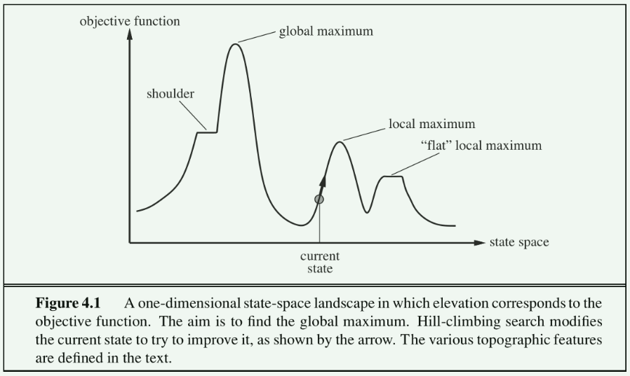
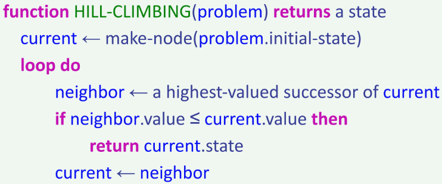
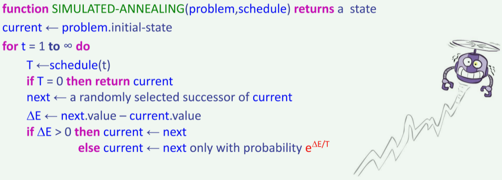

# Local Search（局部搜索）

在之前的Note中，我们希望目标状态，以及到达目标状态的最优路径。但是在一些问题中，我们**只关心找到目标状态**，因为重构到达目标状态的路径是平凡的。

例如，在数独游戏中，最优布局（optimal configuration）就是目标。一旦知道了它，你就能通过将数字一个个填入方块中来得到它。

局部搜索算法允许我们找到目标节点，而不用担心到达目标节点的路径。在局部搜索问题中，状态空间是 **“完整”（complete）解的集合**。我们使用这些算法来尝试找到满足某些约束或者优化某些目标函数的配置（configuration）

> 状态空间从定义上来说，是可能状态的集合。我们说找到了一个解，如果我们找到了一条从起始状态到目标状态的路径。
>
> 又因为在局部搜索问题中，给定一个状态，构造从起始状态到该状态的路径是平凡的，所以我们可以认为这个状态本身蕴含了解的信息。因此，我们说一个状态可以扩展为一个 “完整” 解。

上图描绘了目标函数在状态空间中的一维图像。对该函数而言，我们希望找到对应于最大目标值的状态。局部搜索算法的基本思想是从每个状态局部移动到具有更大目标值的状态，直到达到最大值（希望是全局最大）

我们将介绍四种算法：**爬山算法**（hill-climbing algorithm），**模拟退火算法**（simulated annealing algorithm），**局部束搜索算法**（local beam search algorithm）和**遗传算法**（genetic algorithm）。所有这些算法也用于优化任务，以最大化或最小化目标函数。

## Hill-Climbing Search 爬山搜索

爬山搜索算法（或**最陡上升** steepest-ascent）从当前状态移动到目标值增加最多的相邻状态。该算法不维护搜索树，仅维护目标的状态和对应的值。

爬山的 “贪心” 策略使其很容易陷入**局部最优**（见上图），因为从局部上看，这些点对算法而言是全局最大值或平稳区域（plateaus）。平稳区域（Plateaus）可以分为没有方向使得目标值增长的（“flat local maxima”），或增长缓慢的（“shoulders”）平坦区域。

上面是爬山算法的伪代码。顾名思义，该算法迭代式地移动到具有更大目标值的状态，直到无法继续。

爬山算法是不完备的。另一方面，随机重复爬山算法（Random-restart hill-climbing algorithm）从随机选择的初始状态开始执行多次爬山搜索。由于某种情况下，随机选取的初始状态可以收敛到全局最大值，所以该算法的完备性是平凡的。

注意：在这门课后面你将会遇到术语 “梯度下降（gradient descent）”。它和爬山算法的思想相同，只不过我们不是最大化目标函数，而是最小化代价函数。

## Simulated Annealing Search 模拟退火搜索

我们讨论的第二个局部搜索算法是模拟退火算法。模拟退火旨在结合随机行走（随机移动到附近状态）和爬山算法，以得到一个完整且高效的搜索算法。在模拟退火中，我们允许移动到使目标值降低的状态。

模拟退火算法在每个时间步（timestep）选择一个随机移动。如果该移动可以得到更大的目标值，则总是采用它。如果它得到更小的目标值，则在一定概率上采用它。

这个概率是由温度参数决定的，它最初是高的（更多 “坏的” 移动被采用），然后根据一些 “时间表（schedule）” 降低。

> 这样的一个schedule对应于每个timestep！所以翻译为 “时间表” 更合适

理论上，如果温度下降地足够慢，模拟退火算法达到全局最大值的概率接近1

> 注意：概率的计算方式为 $ e^{\Delta E / T} $，其中 $ \Delta E $ 对应目标值的增量，$ T $ 为温度。
