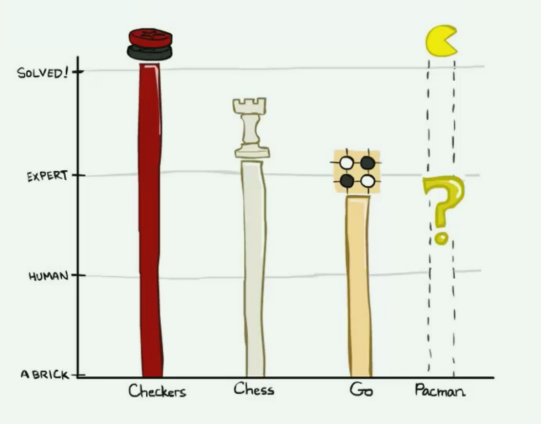

# Game 博弈

在第一篇Note中，我们讨论了搜索问题以及如何高效且最优地解决他们 —— 使用强大的通用搜索算法，我们的智能体可以确定最佳的可能计划，然后简单地执行它以达到目标。

现在，让我们换个角度来考虑这样的场景：智能体有一个或多个试图阻止它们达到目标的**对手**（adversaries）。智能体不能再运行我们已经学过的搜索算法来制定计划，因为我们通常不能确切地知晓对手会如何计划对付我们以及如何对我们的行动做出反应。

相反，我们需要运行一种新的算法来生成**对抗搜索问题**（adversarial search problem）的解，这种问题更常被称为**博弈**（games）

博弈的类型有很多，其可以有产生确定性或随机（概率性）结果的行动，可以有任意数量的玩家，也可以是**零和**的（zero-sum）。

> 在某些情况下，行动产生随机结果意味着我们不能完全观测到行动产生的效果，这可能是因为对环境的不完全观测。
>
> “零和” 意味着对一方有利的东西将对另一方同等程度有害：不存在 “双赢” 结果。（二者之和为0）
>
> 在博弈论中，我们通常用**移动**（move）作为 “动作”（action）的同义词，用**局面**（position）作为 “状态”（state）的同义词。

我们将讨论的第一种博弈类型是**确定性零和博弈**（deterministic zero-sum games），这种博弈的行为具有确定性并且我们的收获直接等价于对手的损失，反之亦然（vice versa）

考察这种博弈最简单的方法是将其定义为一个单一的变量值。一个团队或智能体试图最大化它，而另一个团队或智能体试图最小化它，从而有效地将他们置于直接的竞争中。

在吃豆人中，这个变量是分数。你试图通过快速且高效地吃小球来最大化分数，而鬼魂通过先吃掉你来最小化分数。

许多普通的家喻户晓的博弈也属于这一类：

- **跳棋**（Checkers）：第一个跳棋计算机玩家于1950年问世。此后，跳棋成为一个已解游戏（**solved game**），这意味着在任意一方采取最优行动的前提下，任何局面都能够以确定性方式被评估为胜利、失败或平局。

- **国际象棋**（Chess）：1997年，“深蓝” 成为第一个在六场比赛中击败人类国际象棋冠军 Gray Kasparov 的计算机智能体。“深蓝” 由极其复杂的方法构建而成，每秒可以评估超过两亿个局面。目前的项目甚至性能更好，尽管没有那么具有历史意义。

- **围棋**（Go）：围棋的搜索空间比国际象棋大得多，因此大多数人不相信围棋计算机智能体能在未来几年内击败人类世界冠军。然而，由Google开发的AlphaGo在2016年3月历史性地击败了围棋冠军 Lee Sodol

以上所有世界冠军智能体至少在某种程度上都使用了我们将要介绍的对抗搜索技术（adversarial search technique）

与返回完整计划的常规搜索不同，对抗搜索返回一个策略或政策（a **strategy** or **policy**），它只是在给定智能体和他们的对手的一些配置的情况下，推荐最好的可能移动。

> 由于竞争的存在，且不知道对手的决策方法，我们无法准确的预测出一条完整的路径。虽然我们可以以一定的概率模拟对手可能进行的移动，但是对于一次确定的博弈，对手在某次移动时的方式是确定的，这种预测对于实际过程没有指导意义。
>
> 相反，只是给出接下来应该做的移动，并在下一次根据这些移动与环境交互的反馈来进行下一步的决策，可以更好的应对敌方的行动。

我们很快就会看到，这种算法具有通过计算产生行为的美丽特性 —— 我们运行的计算在概念上相对简单、可广泛推广，且天然就能在同一团队的智能体之间产生合作并 “超越” 对手。

标准的**博弈形式**包括以下定义：

- **初始状态**：$ s_0 $

- **参与者**：$ Players(s) $ 返回状态 $ s $ 下，轮到其移动的参与者

- **移动**：$ Actions(s) $ 返回状态 $ s $ 下，参与者的所有合法移动

- **转移模型**：$ Result(s, a) $ 返回状态 $ s $ 下，执行动作 $ a $ 所产生的结果结果状态

- **终止测试**（Terminal test）：$ Terminal-test(s) $ 测试状态 $ s $ 是否为终止状态

- **终止值**（Terminal values）：$ Utility(s, player) $ 效用函数，返回博弈结束时终止状态 $ s $ 下参与者 $ player $ 最终的数值收益

## Minimax 极小化极大

我们将考察的第一个零和博弈算法是**极小化极大**（Minimax），该算法在以下激励假设（motivating assumption）下运行：我们所面对的对手会表现出最优的行为，并且总执行对我们最不利的移动。

为了介绍该算法，我们必须先形式化**终止效用**（terminal utilities）和**状态值**（state value）的概念。一个状态的值是处于该状态的智能体所能获得的最优分数。为直观理解这个概念的意义，观察以下平凡且简单的吃豆人游戏棋盘（board 将地图网格化，近似认为是一个棋盘）：

假设开始时吃豆人有10分，它每移动一次会损失1分，直到它吃到小球，此时博弈到达终止状态并结束。

我们可以开始为这个棋盘构建**博弈树**（game tree），其中状态的子节点和普通搜索算法的搜索树一样代表后继状态，如下所示：

从树中我们可以清楚看到，如果吃豆人直接走向小球，它在博弈结束时将获得8分。而如果它在任何一点后退，它在博弈结束时获得的分数将更低。既然我们已经生成了一个有若干终止和中间状态的博弈树，我们就可以形式化这些状态的值的含义了。

状态的值被定义为智能体从该状态能取得的最佳可能结果（效用）。稍后我们会更具体的形式化效用（utility）的概念，但现在简单的将智能体的效用看作它获得的分数或点数就足够了。终止状态的值称为**终止效用**（terminal utility），其总是一些确定的已知值和固有的博弈属性。

在吃豆人例子中，最右端的终止状态的值就是8，这是吃豆人直接走向小球所或得的分数。此外，在本例中，非终止状态的值被定义为其子状态的值的最大值。定义 $ V(s) $ 为状态 $ s $ 的值函数，上述讨论可总结如下：

$$
\begin{align}
    \forall \text{ non-terminal states},\space & V(s) = \max_{s' \in successors(s)} V(s') \tag{1} \\
    \forall \text{ terminal states},\space & V(s) = \text{known} \tag{2} \\
\end{align}
$$

这建立了一个非常简单的递归规则。从这个规则中应该能理解，根节点的直接右子节点的值应该为8，直接左子节点的值应该为6，因为这分别是智能体从起始状态向右或向左移动所能获得的最大可能分数。

因此，通过运行这样的计算，智能体可以确定向右移动是最优的，因为开始状态的右子状态的值大于左子状态的值。

现在让我们引入一个新的博弈棋盘，其内有想阻止吃豆人吃掉小球的敌对幽灵。

